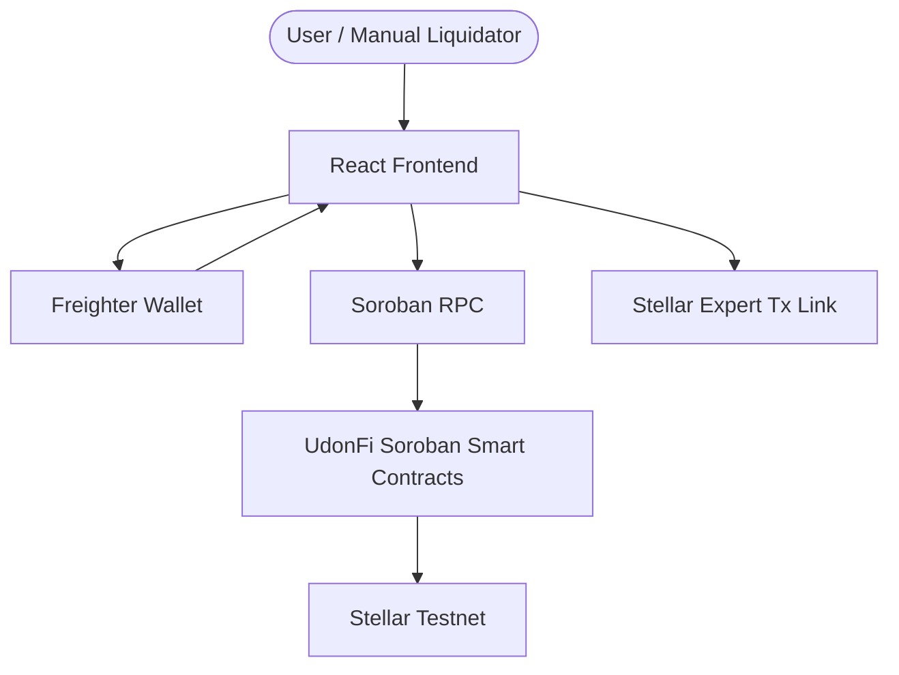

# UdonFi V2 - Soroban Lending MVP

UdonFi V2 is a Stellar Soroban lending protocol. The current MVP is a contract-first demo that runs through a React frontend, Freighter wallet signatures, Soroban RPC reads/writes, Stellar Testnet, and Stellar Expert transaction links.

The MVP does not require an event indexer, liquidation bot, backend analytics service, PostgreSQL sync pipeline, queue system, or background workers.

## Current MVP Scope

- Soroban smart contracts.
- Frontend direct contract interaction.
- Freighter wallet connection and transaction signing.
- Soroban RPC reads and writes.
- Deposit.
- Withdraw.
- Borrow.
- Repay.
- Basic Health Factor.
- Manual liquidation callable by a user or liquidator.
- Stellar Expert transaction links after transaction submission.
- Basic contract events for debugging and Stellar Explorer visibility.

## Explicitly Out of MVP Scope

- Event Indexer.
- Liquidation Bot.
- Analytics Backend.
- PostgreSQL Event Sync.
- Real-time Dashboard Pipeline.
- Background Workers.
- Queue system.
- Sync lag strategy.
- Indexer checkpoint and replay system.

## New MVP Architecture

```text
React Frontend
    |
Freighter Wallet
    |
Soroban RPC
    |
UdonFi Soroban Smart Contracts
    |
Stellar Testnet
    |
Stellar Expert transaction links
```



## Post-MVP / Future Work

The following work remains useful but is not required for the MVP demo:

- Event indexer and event replay pipeline.
- Liquidation monitoring bot.
- Backend analytics API.
- PostgreSQL event sync and single-writer policies.
- Real-time dashboard WebSocket pipeline.
- Sync lag detection and degraded UI modes.
- Queue/backpressure/checkpoint systems.

Future-work notes live under [docs/future-work](docs/future-work/).

## Repository Layout

```text
contracts/      Soroban smart contracts and core MVP modules
frontend/       React frontend for direct Soroban RPC + Freighter flows
docs/           Protocol, architecture, roadmap, and project docs
tests/          Contract and MVP integration test docs/tests
backend/        Optional Post-MVP analytics/caching service plan
indexer/        Optional Post-MVP event indexer plan
indexer_bot/    Legacy/Post-MVP bot and indexer experiments
diagrams/       Architecture and flow diagrams
```

## Development Commands

Run contract tests:

```bash
cd contracts
cargo test
```

Run frontend locally:

```bash
cd frontend
npm install
npm run dev
```

Build frontend:

```bash
cd frontend
npm run build
```

The root `package.json` has no MVP scripts. Backend/indexer packages are not required to run the MVP demo.

## Documentation

- [Overview](docs/00-overview.md)
- [System Architecture](docs/02-system-architecture.md)
- [C4 Model](docs/03-c4-model.md)
- [Business Flows](docs/04-business-flows.md)
- [API Spec](docs/06-api-spec.md)
- [Security Model](docs/08-security-model.md)
- [Roadmap](docs/12-roadmap.md)
- [Performance Budget](docs/21-performance-budget.md)
- [MVP Scope Refactor Report](docs/reviews/mvp-scope-refactor-report.md)

## Status

UdonFi V2 MVP scope is simplified to a contract + frontend + Freighter + Soroban RPC demo. It is not production-ready and is not approved for mainnet.

## License

This repository is licensed under the Apache License, Version 2.0. See [LICENSE](LICENSE) for details.
