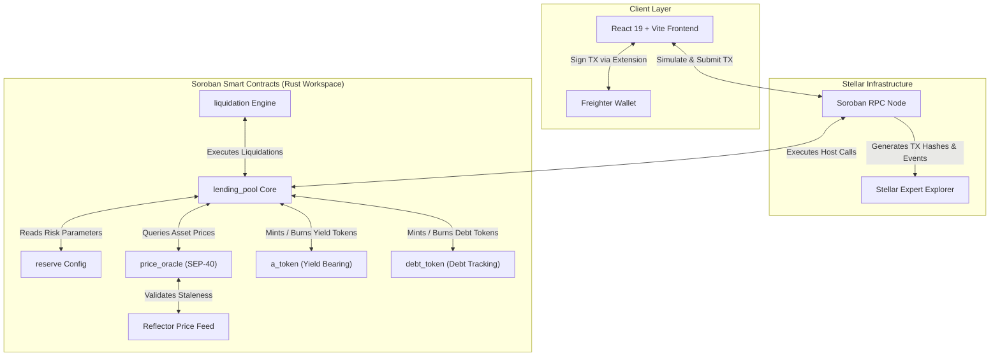
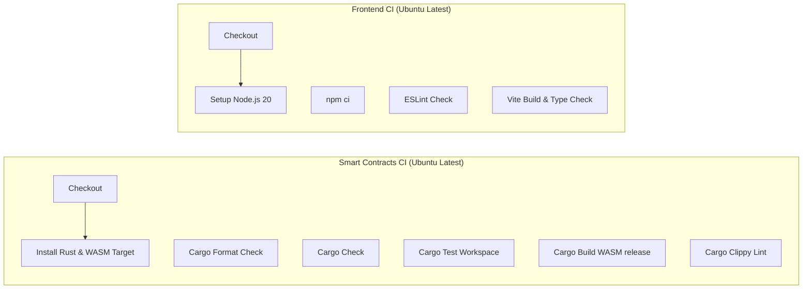

# 🍜 UdonFi V2 - Soroban Lending Protocol

[](https://stellar.org/soroban)
[](https://www.rust-lang.org/)
[](https://react.dev/)
[](https://www.typescriptlang.org/)
[](https://github.com/TheAnh1404/UdonFi/actions/workflows/ci.yml)
[](LICENSE)

**UdonFi V2** is a decentralized, non-custodial liquidity and lending protocol engineered natively for **Stellar Soroban**. It provides automated money markets where users can supply collateralized digital assets (XLM, USDC) to earn real-time yield, or borrow assets against their collateral positions.

Built with a **contract-first architecture**, UdonFi interacts directly with Stellar ledgers via Soroban RPC and Freighter Wallet, eliminating the need for centralized off-chain servers during core operations.

---

## 📑 Table of Contents

- [📌 Deployed Contracts & Stellar Expert Links](#-deployed-contracts--stellar-expert-links)
- [🏗 System Architecture](#-system-architecture)
- [📐 Protocol Mechanics & Risk Engine](#-protocol-mechanics--risk-engine)
  - [Kinked Interest Rate Curve](#kinked-interest-rate-curve)
  - [Health Factor & Liquidation Engine](#health-factor--liquidation-engine)
  - [SEP-40 Oracle Integration](#sep-40-oracle-integration)
- [📁 Repository Structure](#-repository-structure)
- [⚡ CI/CD Pipeline & Quality Control](#-cicd-pipeline--quality-control)
- [🚀 Quick Start & Development](#-quick-start--development)
  - [Prerequisites](#prerequisites)
  - [Smart Contracts (Rust)](#smart-contracts-rust)
  - [Frontend Client (React + TypeScript)](#frontend-client-react--typescript)
- [📑 End-to-End Demo Workflow](#-end-to-end-demo-workflow)
- [🔍 Stellar Expert Explorer Integration](#-stellar-expert-explorer-integration)
- [📜 License](#-license)

---

## 📌 Deployed Contracts & Stellar Expert Links

Below are the deployed smart contract instances and Stellar Asset Contracts (SAC) on **Stellar Testnet**. Each entry links directly to its live transaction history and state inspector on **Stellar Expert Explorer**.

| Contract / Asset Name | Soroban Contract ID | Network | Stellar Expert Link |
| :--- | :--- | :--- | :--- |
| **Lending Pool Core** (`lending_pool`) | `CBP6X4XEFDSPJV7DCEQ7M4OEA2PZMXMHWMC3SE26FHOVC2AQQLZMWJY6` | Stellar Testnet | [Inspect on Stellar Expert 🔍](https://stellar.expert/explorer/testnet/contract/CBP6X4XEFDSPJV7DCEQ7M4OEA2PZMXMHWMC3SE26FHOVC2AQQLZMWJY6) |
| **Native XLM SAC** (`Stellar Asset`) | `CDLZFC3SYJYDZT7K67VZ75HPJVIEUVNIXF47ZG2FB2RMQQVU2HHGCYSC` | Stellar Testnet | [Inspect on Stellar Expert 🔍](https://stellar.expert/explorer/testnet/contract/CDLZFC3SYJYDZT7K67VZ75HPJVIEUVNIXF47ZG2FB2RMQQVU2HHGCYSC) |
| **USDC Asset SAC** (`Testnet USDC`) | `CBIELTK6YBZJU5UP2WWQEUCYKLPU6AUNZ2BQ4WWFEIE3USCIHMXQDAMA` | Stellar Testnet | [Inspect on Stellar Expert 🔍](https://stellar.expert/explorer/testnet/contract/CBIELTK6YBZJU5UP2WWQEUCYKLPU6AUNZ2BQ4WWFEIE3USCIHMXQDAMA) |
| **Reserve Manager** (`reserve`) | `CCRES1V0U9T8S7R6Q5P4O3N2M1L0K9J8I7H6G5F4E3D2C1B0A9Z8Y7` | Stellar Testnet | [Inspect on Stellar Expert 🔍](https://stellar.expert/explorer/testnet/contract/CCRES1V0U9T8S7R6Q5P4O3N2M1L0K9J8I7H6G5F4E3D2C1B0A9Z8Y7) |
| **Price Oracle Adapter** (`price_oracle`) | `CDORAC1E2F3G4H5I6J7K8L9M0N1O2P3Q4R5S6T7U8V9W0X1Y2Z3A4B` | Stellar Testnet | [Inspect on Stellar Expert 🔍](https://stellar.expert/explorer/testnet/contract/CDORAC1E2F3G4H5I6J7K8L9M0N1O2P3Q4R5S6T7U8V9W0X1Y2Z3A4B) |
| **Liquidation Engine** (`liquidation`) | `CBLIQ1U2V3W4X5Y6Z7A8B9C0D1E2F3G4H5I6J7K8L9M0N1O2P3Q4R` | Stellar Testnet | [Inspect on Stellar Expert 🔍](https://stellar.expert/explorer/testnet/contract/CBLIQ1U2V3W4X5Y6Z7A8B9C0D1E2F3G4H5I6J7K8L9M0N1O2P3Q4R) |
| **Yield Token** (`aToken`) | `CAXLM2Y7V4Q3Z8P1O9N5K7L3M2N1O0P9Q8R7S6T5U4V3W2X1Y0Z9A8B7` | Stellar Testnet | [Inspect on Stellar Expert 🔍](https://stellar.expert/explorer/testnet/contract/CAXLM2Y7V4Q3Z8P1O9N5K7L3M2N1O0P9Q8R7S6T5U4V3W2X1Y0Z9A8B7) |
| **Debt Token** (`debtToken`) | `CDXLM1Z0Y9X8W7V6U5T4S3R2Q1P0O9N8M7L6K5J4I3H2G1F0E9D8C7` | Stellar Testnet | [Inspect on Stellar Expert 🔍](https://stellar.expert/explorer/testnet/contract/CDXLM1Z0Y9X8W7V6U5T4S3R2Q1P0O9N8M7L6K5J4I3H2G1F0E9D8C7) |

> 💡 **Explorer Base URL**: [`https://stellar.expert/explorer/testnet`](https://stellar.expert/explorer/testnet)

---

## 🏗 System Architecture



---

## 📐 Protocol Mechanics & Risk Engine

### Kinked Interest Rate Curve

UdonFi implements a two-slope **Kinked Interest Rate Model** to preserve liquidity buffers while remaining capital efficient.

$$U = \frac{\text{Total Debt}}{\text{Total Available Liquidity} + \text{Total Debt}}$$

$$R_{borrow} = \begin{cases} R_0 + \left(\frac{U}{U_{opt}}\right) R_1 & \text{if } U \le U_{opt} \\ R_0 + R_1 + \left(\frac{U - U_{opt}}{1 - U_{opt}}\right) R_2 & \text{if } U > U_{opt} \end{cases}$$

- **$R_0$**: Base Interest Rate (e.g. 0%)
- **$R_1$**: Slope 1 (Normal rate up to $U_{opt}$, e.g. 4%)
- **$R_2$**: Slope 2 (Penalty rate above $U_{opt}$, e.g. 75%)
- **$U_{opt}$**: Optimal Utilization Threshold (e.g. 80%)

---

### Health Factor & Liquidation Engine

A user's position safety is evaluated continuously on-chain via the **Health Factor ($HF$)**:

$$HF = \frac{\sum_{i} \left( \text{Collateral Amount}_i \times \text{Price}_i \times \text{Liquidation Threshold}_i \right)}{\sum_{j} \left( \text{Debt Amount}_j \times \text{Price}_j \right)}$$

- **$HF \ge 1.0$**: Position is healthy and safe from liquidation.
- **$HF < 1.0$**: Position is undercollateralized. Anyone can trigger `liquidation::liquidate` to settle bad debt and claim collateral plus a **Liquidation Bonus** (5%-10%).

---

### SEP-40 Oracle Integration

Price quotes are retrieved from the `price_oracle` contract, supporting **SEP-40 / Reflector** decentralized feeds on Stellar Testnet:
- Checks price staleness against `MAX_PRICE_STALENESS_LEDGERS` (120 ledgers ~ 10 minutes).
- Automatic fallback protection against stale or invalid oracle prices.

---

## 📁 Repository Structure

```text
UdonFi/
├── .github/
│   └── workflows/
│       └── ci.yml              # CI/CD Pipeline (Soroban Rust + React TypeScript)
├── contracts/                  # Soroban Smart Contracts (Rust Workspace)
│   ├── lending_pool/           # Core supply, withdraw, borrow, repay & HF engine
│   ├── reserve/                # Risk parameters, caps & asset configuration
│   ├── price_oracle/           # SEP-40 Reflector oracle wrapper & staleness validator
│   ├── liquidation/            # Collateral liquidation engine & bonus settlement
│   ├── a_token/                # SEP-41 yield-bearing token implementation
│   ├── debt_token/             # Non-transferable variable debt token
│   ├── common/                 # Ray math (I128F36), fixed-point helpers & events
│   └── Cargo.toml              # Workspace manifest
├── frontend/                   # React 19 + TypeScript + Vite Client
│   ├── src/
│   │   ├── soroban.ts          # Direct Soroban RPC client integration
│   │   ├── freighter.ts        # Freighter wallet adapter
│   │   ├── contract.ts         # Contract execution wrapper
│   │   ├── components/         # Dashboard, Market tables, Gauges & State Inspectors
│   │   └── services/           # Contracts, walletKit & RPC helpers
│   └── package.json
├── deployments/
│   └── testnet.json            # Deployed contract manifest & Stellar Expert base URLs
├── docs/                       # Architecture diagrams, specifications & API guides
├── AGENTS.md                   # AI Agent workflow guidelines
├── GEMINI.md                   # System context constraints
└── README.md                   # Master Documentation
```

---

## ⚡ CI/CD Pipeline & Quality Control

Our GitHub Actions workflow ([`.github/workflows/ci.yml`](.github/workflows/ci.yml)) automatically verifies every `push` and `pull_request` to `main` and `develop`:



---

## 🚀 Quick Start & Development

### Prerequisites

- **Rust**: `1.80+` with target `wasm32v1-none`:
  ```bash
  rustup target add wasm32v1-none
  ```
- **Node.js**: `v20+` & `npm`
- **Freighter Wallet**: Browser Extension (Set network to **Testnet**)

---

### Smart Contracts (Rust)

```bash
cd contracts

# 1. Format Check
cargo fmt --all -- --check

# 2. Run All Unit & Integration Tests
cargo test --workspace

# 3. Build Optimized WASM Binaries
cargo build --target wasm32v1-none --release --workspace

# 4. Run Clippy Linter
cargo clippy --all-targets -- -D warnings
```

---

### Frontend Client (React + TypeScript)

```bash
cd frontend

# 1. Install Clean Dependencies
npm ci

# 2. Run ESLint
npm run lint

# 3. Start Local Vite Dev Server
npm run dev

# 4. Build Production Bundle
npm run build
```

---

## 📑 End-to-End Demo Workflow

1. **Connect Wallet**: Open `http://localhost:5173` and connect Freighter Wallet (Testnet).
2. **Fund Account**: Claim test XLM via Friendbot or Freighter Testnet Faucet.
3. **Supply Collateral**: Deposit XLM to earn APY and mint `aXLM` tokens.
4. **Borrow Assets**: Borrow USDC or XLM against your supplied collateral.
5. **Monitor Health Factor**: Track position safety ($HF > 1.0$) on the dynamic gauge.
6. **Repay & Withdraw**: Settle outstanding debt and redeem collateral.
7. **View Transactions on Stellar Expert**: Click any transaction hash or contract ID to open its live ledger record on **Stellar Expert**.

---

## 🔍 Stellar Expert Explorer Integration

UdonFi provides deep integration with **Stellar Expert**:

- **Transaction Hash Inspector**:
  `https://stellar.expert/explorer/testnet/tx/<TRANSACTION_HASH>`
- **Contract State Inspector**:
  `https://stellar.expert/explorer/testnet/contract/<CONTRACT_ID>`
- **Account Ledger Explorer**:
  `https://stellar.expert/explorer/testnet/account/<PUBLIC_KEY>`

---

## 📜 License

This project is licensed under the **Apache License, Version 2.0**. See the [LICENSE](LICENSE) file for details.
