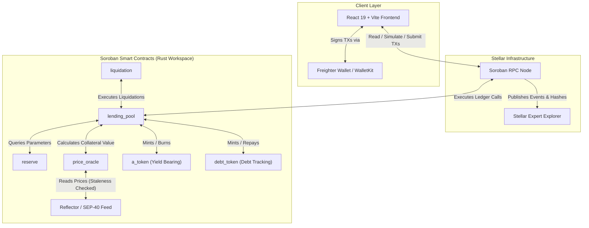

# 🍜 UdonFi V2 - Soroban Lending Protocol MVP

[](https://stellar.org/soroban)
[](https://www.rust-lang.org/)
[](https://react.dev/)
[](https://www.typescriptlang.org/)
[](https://github.com/TheAnh1404/UdonFi/actions/workflows/ci.yml)
[](LICENSE)

**UdonFi V2** is a decentralized, non-custodial money market protocol built on **Stellar Soroban**. It provides automated liquidity pools where users can supply collateralized digital assets (such as XLM and USDC) to earn yield, or borrow assets against their collateral positions. 

This repository implements the complete contract-first MVP architecture, featuring Rust smart contracts, direct Soroban RPC queries, Freighter wallet transaction signing, and real-time visualization on Stellar Testnet.

---

## 📑 Table of Contents

- [Overview & Architecture](#-overview--architecture)
- [Protocol Mechanics & Risk Parameters](#-protocol-mechanics--risk-parameters)
  - [Kinked Interest Rate Model](#kinked-interest-rate-model)
  - [Health Factor & Risk Valuation](#health-factor--risk-valuation)
  - [Oracle Integration & Security](#oracle-integration--security)
  - [Liquidation Mechanism](#liquidation-mechanism)
- [Repository Structure](#-repository-structure)
- [Smart Contracts Breakdown](#-smart-contracts-breakdown)
- [Frontend Features](#-frontend-features)
- [Environment Configuration](#-environment-configuration)
- [Getting Started](#-getting-started)
  - [Prerequisites](#prerequisites)
  - [Smart Contracts: Build & Test](#smart-contracts-build--test)
  - [Testnet Deployment & Initialization](#testnet-deployment--initialization)
  - [Frontend Development](#frontend-development)
- [End-to-End Demo Workflow](#-end-to-end-demo-workflow)
- [Stellar Expert Explorer Integration](#-stellar-expert-explorer-integration)
- [Scope & Limitations](#-scope--limitations)
- [License](#-license)

---

## 🏗 Overview & Architecture

UdonFi is built contract-first to operate directly on the Stellar ledger via Soroban host functions. The architecture requires **no off-chain centralized servers** for its core lending and borrowing interactions.

### System Architecture Diagram



---

## 📐 Protocol Mechanics & Risk Parameters

### Kinked Interest Rate Model

UdonFi uses a two-slope **Kinked Interest Rate Curve** to balance capital efficiency and liquidity buffer preservation. When pool utilization $U$ is below the optimal threshold $U_{opt}$, interest rates scale gradually. Above $U_{opt}$, interest rates increase steeply to encourage debt repayments and new deposits.

$$\text{Utilization Rate } U = \frac{\text{Total Debt}}{\text{Total Available Liquidity} + \text{Total Debt}}$$

$$R_{borrow} = \begin{cases} R_0 + \left(\frac{U}{U_{opt}}\right) R_1 & \text{if } U \le U_{opt} \\ R_0 + R_1 + \left(\frac{U - U_{opt}}{1 - U_{opt}}\right) R_2 & \text{if } U > U_{opt} \end{cases}$$

- $R_0$: Base Borrow Rate
- $R_1$: Slope 1 (Normal Utilization Rate)
- $R_2$: Slope 2 (Excess Utilization Rate Penalty)
- $U_{opt}$: Optimal Utilization Point (e.g. 80%)

---

### Health Factor & Risk Valuation

A user's position safety is continuously monitored via the **Health Factor ($HF$)**. If $HF < 1.0$, the account is undercollateralized and vulnerable to liquidation.

$$HF = \frac{\sum_{i} \left( \text{Collateral Amount}_i \times \text{Price}_i \times \text{Liquidation Threshold}_i \right)}{\sum_{j} \left( \text{Debt Amount}_j \times \text{Price}_j \right)}$$

- **Loan-to-Value (LTV)**: Maximum borrowing power ratio when opening a position.
- **Liquidation Threshold (LT)**: Maximum collateral ratio before position becomes liquidation-eligible.
- **Liquidation Bonus / Penalty**: Discount incentive granted to liquidators who settle bad debt.

---

### Oracle Integration & Security

Price calculations rely on the `price_oracle` contract, supporting two operational modes:

1. **Reflector Mode (`reflector`)**: Integrates directly with deployed **SEP-40 / Reflector** decentralized price feeds on Stellar Testnet. Prices are checked against `MAX_PRICE_STALENESS_LEDGERS` (e.g., 120 ledgers) to reject stale price data.
2. **Manual Mode (`manual`)**: Fallback mode for isolated local unit testing and development.

---

### Liquidation Mechanism

When $HF < 1.0$:
1. Liquidator triggers `liquidation::liquidate`.
2. Liquidator repays up to the permitted debt amount on behalf of the borrower.
3. Liquidator receives equivalent borrower collateral plus a **Liquidation Bonus** (e.g., 5-10%).
4. Debt tokens are burned, restoring pool solvency.

---

## 📂 Repository Structure

```text
UdonFi/
├── .github/
│   └── workflows/
│       └── ci.yml              # Automated GitHub Actions CI/CD Pipeline (Rust + React)
├── contracts/                  # Soroban Smart Contract Rust Workspace
│   ├── src/lib.rs              # Root workspace re-export entrypoint
│   ├── lending_pool/           # Core supply, withdraw, borrow, repay, health factor logic
│   ├── reserve/                # Asset risk parameter configurations & cap enforcement
│   ├── price_oracle/           # Oracle wrapper with Reflector SEP-40 integration
│   ├── liquidation/            # Collateral liquidation engine & bonus calculation
│   ├── a_token/                # SEP-41 compliant interest-bearing token implementation
│   ├── debt_token/             # Variable debt tracking token implementation
│   ├── common/                 # Shared data structures, fixed-point math, interest models & errors
│   └── Cargo.toml              # Cargo workspace manifest
├── frontend/                   # React 19 + TypeScript + Vite Client
│   ├── src/
│   │   ├── soroban.ts          # Soroban RPC integration entrypoint
│   │   ├── freighter.ts        # Freighter wallet connection entrypoint
│   │   ├── contract.ts         # Contract invocation wrapper
│   │   ├── components/         # Dashboard, Market tables, Gauges, Flow visualization
│   │   ├── services/           # Underlying RPC, wallet, and contract helper implementations
│   │   └── App.tsx             # Root application & state binding
│   └── package.json            # Frontend scripts & dependencies
├── src/                        # Root integration entrypoints (soroban.ts, freighter.ts, contract.ts)
├── deployments/                # Deployed contract address manifests (e.g., testnet.json)
├── docs/                       # Architecture, product specs, diagrams & demo guides
├── AGENTS.md                   # AI agent environment rules & instructions
├── GEMINI.md                   # Gemini context & execution constraints
└── README.md                   # Protocol overview & documentation
```

---

## ⚙️ Smart Contracts Breakdown

| Crate | Role & Description |
| :--- | :--- |
| `lending_pool` | Entry point contract handling pool deposits, withdrawals, borrowing, repayments, interest accrual, reserve balances, and Health Factor queries. |
| `reserve` | Manages supported asset configurations: LTV, Liquidation Threshold, Liquidation Bonus, Supply Caps, Borrow Caps, and asset status (Active / Frozen). |
| `price_oracle` | Provides standardized price quotes for protocol assets in USD, with staleness validation and support for SEP-40 Reflector contracts. |
| `liquidation` | Manages manual liquidation procedures, collateral bonus calculations, and debt repayment settlement. |
| `a_token` | Interest-bearing token minted to suppliers representing claims on underlying liquidity + accrued interest. |
| `debt_token` | Non-transferable token minted to borrowers representing outstanding liability. |
| `common` | Shared fixed-point arithmetic (`I128F36` ray math), bitmap encoding helpers, system events, and error definitions. |

---

## 🎨 Frontend Features

The UdonFi frontend is built with React 19, TypeScript, and Vite, designed to offer a visual experience with real-time on-chain state inspection:

- 🔗 **Direct Wallet & RPC Connectivity**: Supports Freighter wallet and Stellar Wallets Kit for transaction signing directly against Soroban RPC.
- 📊 **Credit Market & Liquidity Pools**: Real-time asset overview showing Total Value Locked (TVL), Supply APY, Borrow APY, and Utilization rates.
- 🛡️ **Position Risk Gauge**: Interactive Health Factor visualization warning users when approaching liquidation thresholds.
- 📈 **Interactive Kinked Interest Rate Curve (`SorobanKinked`)**: Dynamic visualization of interest rates relative to pool utilization $U$.
- 🔍 **Soroban State & Bitmap Inspector (`SorobanBitmap`, `SorobanTtl`)**: Real-time display of on-chain bitmask configurations, ledger entry TTLs, and storage states.
- 💸 **Token Flow Ledger (`TokenFlowLedger`)**: Interactive visualization tracking liquidity movements between user balances, reserve pools, and debt contracts.
- 🔗 **Stellar Expert Links**: Direct link generation for every submitted transaction hash and deployed contract ID.

---

## 🔧 Environment Configuration

Copy the example environment files before running the project:

### Contract Deployment Environment (`contracts/.env`)

```bash
cp contracts/.env.example contracts/.env
```

Key environment variables:

| Variable | Description |
| :--- | :--- |
| `SOROBAN_RPC_URL` | Target Soroban RPC endpoint (e.g. `https://soroban-testnet.stellar.org:443`) |
| `SOROBAN_NETWORK_PASSPHRASE` | Stellar network passphrase (e.g. `"Test SDF Network ; September 2015"`) |
| `DEPLOYER_SECRET_KEY` | Stellar secret key (S...) used for deploying contracts |
| `ORACLE_MODE` | Price oracle mode (`reflector` for Testnet or `manual` for dev) |
| `REFLECTOR_CONTRACT_ID` | Reflector SEP-40 contract address on Testnet |
| `MAX_PRICE_STALENESS_LEDGERS`| Maximum allowed age of oracle price data in ledgers (e.g. `120`) |
| `XLM_ASSET_CONTRACT_ID` | SAC (Stellar Asset Contract) address for native XLM |
| `USDC_ASSET_CONTRACT_ID` | SAC address for USDC on Testnet |

### Frontend Environment (`frontend/.env.local`)

```bash
cp frontend/.env.example frontend/.env.local
```

*Note: Frontend configuration uses the same key names with the `VITE_` prefix (e.g. `VITE_SOROBAN_RPC_URL`, `VITE_LENDING_POOL_CONTRACT_ID`).*

---

## 🚀 Getting Started

### Prerequisites

- **Rust Toolchain**: `1.80+` with the `wasm32v1-none` target installed:
  ```bash
  rustup target add wasm32v1-none
  ```
- **Stellar CLI**: Installed and configured for Testnet operations.
- **Node.js**: `v18+` or `v20+` with `npm`.
- **Freighter Wallet**: Browser extension set to **Testnet**.

---

### Smart Contracts: Build & Test

Navigate to the `contracts/` directory:

```bash
cd contracts

# Build optimized WASM binaries
cargo build --target wasm32v1-none --release

# Run unit and integration tests
cargo test

# Check code formatting and run clippy lints
cargo fmt -- --check
cargo clippy --all-targets -- -D warnings
```

---

### Testnet Deployment & Initialization

Automated bash deployment scripts are provided in `contracts/scripts/`:

```bash
cd contracts

# 1. Deploy WASM binaries to Testnet
bash scripts/deploy-testnet.sh

# 2. Initialize oracle, reserve configurations, and token contracts
bash scripts/init-testnet.sh

# 3. Verify on-chain contract state and callability
bash scripts/verify-testnet.sh
```

`deploy-testnet.sh` automatically updates `deployments/testnet.json` and writes contract addresses directly into `frontend/.env.local`.

---

### Frontend Development

Navigate to the `frontend/` directory:

```bash
cd frontend

# Install dependencies
npm install

# Start local Vite development server
npm run dev

# Build production distribution
npm run build

# Run ESLint check
npm run lint
```

---

## 📑 End-to-End Demo Workflow

To test the protocol flow on Stellar Testnet:

1. **Connect Wallet**: Open the frontend (`http://localhost:5173`) and connect Freighter Wallet on Stellar Testnet.
2. **Fund Account**: Obtain Testnet XLM via Friendbot or Freighter faucet.
3. **Supply Collateral**: Deposit XLM into the protocol. Confirm the transaction in Freighter and inspect the generated **Stellar Expert** link.
4. **Verify aTokens**: Check your account balance for minted `aXLM` tokens representing your deposit.
5. **Borrow Assets**: Borrow XLM or USDC against your collateral position. Monitor your position's **Health Factor ($HF$)**.
6. **Repay Debt**: Repay part or all of your borrowed debt using the interaction panel.
7. **Withdraw Collateral**: Withdraw supplied XLM back to your wallet.
8. **Simulate Liquidation**: Lower collateral or manipulate mock price state (in test mode) to trigger position liquidation via `contracts/liquidation`.

---

## 🔍 Stellar Expert Explorer Integration

UdonFi generates verification links pointing directly to Stellar Expert on Testnet:

- **Transaction Explorer**:
  ```text
  https://stellar.expert/explorer/testnet/tx/<TRANSACTION_HASH>
  ```
- **Contract Inspector**:
  ```text
  https://stellar.expert/explorer/testnet/contract/<CONTRACT_ID>
  ```

---

## ⚠️ Scope & Limitations

- **MVP Target**: Built specifically as a contract-first proof-of-concept on Stellar Testnet.
- **No Off-Chain Dependency**: Core lending functionality functions without requiring off-chain indexers or relayers.
- **Mainnet Readiness**: This code is for testing and demonstration purposes. It has not undergone formal third-party security audits for production mainnet use.

---

## 📜 License

This repository is distributed under the terms of the **Apache License, Version 2.0**. See the [LICENSE](LICENSE) file for complete details.
