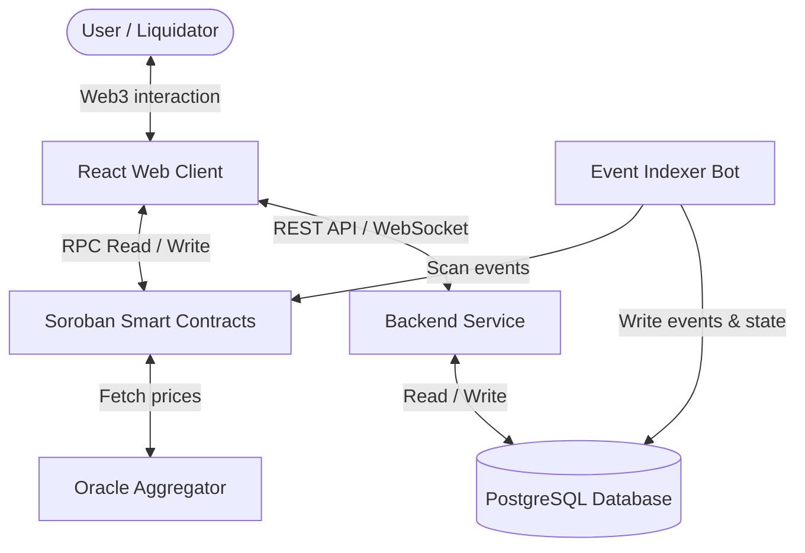

# 🍜 UdonFi V2 — Decentralized Lending Protocol on Stellar Soroban

[](https://soroban.stellar.org/)
[](https://www.rust-lang.org/)
[](https://www.postgresql.org/)
[](https://vitejs.dev/)

UdonFi V2 is a decentralized, collateralized lending protocol built on the Stellar Soroban smart contract framework. It features an optimized risk management engine, modular contract architecture, decentralized governance, multi-oracle price feeds, and a specialized event-driven off-chain indexing architecture.

The protocol optimizes for Stellar Soroban's ledger fees and transaction execution constraints through state bit-packing and split transaction flows.

---

## 🏗️ Architecture Overview

The protocol is structured as a monorepo containing the on-chain smart contracts, a real-time event indexing agent, a database backend, and a premium React-based dashboard.



Detailed architectural diagrams are located in the [diagrams/](file:///d:/TheAnhProject/UdonFi/diagrams) directory:
- [System Architecture Specification](file:///d:/TheAnhProject/UdonFi/docs/02-system-architecture.md)
- [C4 Structural Model Diagrams](file:///d:/TheAnhProject/UdonFi/docs/03-c4-model.md)
- [Detailed Transaction Flow Sequences](file:///d:/TheAnhProject/UdonFi/docs/04-business-flows.md)

---

## ⚡ Core Features & Engineering Optimizations

### 1. Modular Smart Contract Structure
V2 decomposes the lending logic into modular, single-responsibility smart contracts to maintain upgradeability, keep WASM sizes under VM limits, and reduce compile-time dependencies:
- **`lending_pool`**: Core asset supply and withdrawal coordinator.
- **`risk_engine`**: Vault health factor evaluation.
- **`interest_rate_engine`**: Kinked APY calculation.
- **`liquidation_coordinator`**: 2-step liquidation processing.
- **`governance`**: Proposal submission, voting, and contract timelocks.
- **`price_oracle_aggregator`**: Decoupled price compilation interface.
- **`reserve_config`**: Reserve configuration registry.

### 2. State-Packing Bitmap
User vault settings are packed into a single `u128` integer rather than utilizing dynamic key-value storage. By dedicating 2 bits per asset market (Bit $2i$ for Collateral eligibility, Bit $2i+1$ for Borrow active status), read/write storage overhead is minimized.

### 3. CPU-Resilient 2-Step Liquidation
To prevent transaction failures due to Soroban's 100M CPU instruction limit, liquidations are executed in two stages:
1. **`prepare_liquidation`**: Evaluates position health, locks the targeted user collateral, and stores a cryptographically signed execution session on-chain.
2. **`execute_liquidation`**: Pays down the debt, releases the collateral to the liquidator, and credits the liquidation bonus.

### 4. Automated TTL Extensions
Every write action (Supply, Borrow, Repay, Withdraw) automatically executes a storage TTL extension (`extend_ttl`) to ensure crucial user positions do not expire or get evicted from the ledger state.

---

## 🛠️ Technology Stack

- **Smart Contracts**: Rust, Soroban SDK (v25.0.1).
- **Frontend Client**: React 19, Vite 8, TypeScript, custom glassmorphism styling, Tailwind, Lucide React.
- **Backend Services**: Node.js, Express/Fastify, TypeScript.
- **Database Layer**: PostgreSQL (with Redis for websocket cache).
- **Indexer Bot**: Node.js, Stellar SDK (XDR decoding).
- **Oracle Integrations**: Pyth Network, Band Protocol.

---

## 📂 Repository Directory Structure

```text
UdonFi/
├── contracts/                  # Soroban Smart Contracts (Rust)
│   ├── lending_pool/           # Core supply/withdraw logic
│   ├── liquidation/            # 2-step liquidation coordinator
│   ├── reserve/                # Reserve config registry
│   ├── price_oracle/           # Oracle aggregator interface
│   ├── common/                 # Bitwise math & shared libraries
│   └── README.md               # Contract developer handbook
│
├── frontend/                   # React Web3 Dashboard
│   ├── src/                    # Components, hooks, state
│   └── README.md               # Frontend styling & wallet layers
│
├── backend/                    # TypeScript REST & WebSocket Service
│   └── README.md               # Backend APIs & DB synchronization
│
├── indexer/                    # PostgreSQL Event Indexer Bot
│   └── README.md               # Event pipelines & decoders
│
├── docs/                       # Core Technical Specifications
│   ├── adr/                    # Architecture Decision Records
│   └── README.md               # Index of technical specifications
│
├── diagrams/                   # Mermaid Architectural Diagrams
│
├── tests/                      # Testing Framework Specifications
│   └── README.md               # Fuzz, load, and E2E specs
│
└── scripts/                    # Deploy & Protocol Admin automation
    └── README.md               # Script registry and parameters
```

---

## 📝 Documentation Index

All architectural decisions and mathematical parameters are documented in detail inside the [docs/](file:///d:/TheAnhProject/UdonFi/docs) folder:

### 1. Specifications
*   [00-Overview](file:///d:/TheAnhProject/UdonFi/docs/00-overview.md): Executive overview and system objectives.
*   [01-Product Requirements](file:///d:/TheAnhProject/UdonFi/docs/01-product-requirements.md): System capabilities, mathematical definitions, and constraints.
*   [02-System Architecture](file:///d:/TheAnhProject/UdonFi/docs/02-system-architecture.md): Blueprint of the codebase, boundary layouts, and sub-systems.
*   [03-C4 Model](file:///d:/TheAnhProject/UdonFi/docs/03-c4-model.md): Context, Container, Component, and Deployment schemas.
*   [04-Business Flows](file:///d:/TheAnhProject/UdonFi/docs/04-business-flows.md): Step-by-step transaction flow sequence diagrams.
*   [05-Smart Contract Spec](file:///d:/TheAnhProject/UdonFi/docs/05-smart-contract-spec.md): Methods, storage parameters, and state transition validation rules.
*   [06-API Spec](file:///d:/TheAnhProject/UdonFi/docs/06-api-spec.md): REST endpoints and real-time WebSockets specifications.
*   [07-Database Design](file:///d:/TheAnhProject/UdonFi/docs/07-database-design.md): PostgreSQL Schema design, indexes, and ERD.
*   [08-Security Model](file:///d:/TheAnhProject/UdonFi/docs/08-security-model.md): Threat modeling, risk matrix, and circuit-breaker details.
*   [09-Testing Strategy](file:///d:/TheAnhProject/UdonFi/docs/09-testing-strategy.md): Unit, integration, fuzzing, and load testing guidelines.
*   [10-Deployment Plan](file:///d:/TheAnhProject/UdonFi/docs/10-deployment-plan.md): Multi-sig administration, TTL variables, and mainnet checklist.
*   [11-Governance](file:///d:/TheAnhProject/UdonFi/docs/11-governance.md): Proposal lifecycles, voting formulas, and voting locks.
*   [12-Roadmap](file:///d:/TheAnhProject/UdonFi/docs/12-roadmap.md): Milestones, token distribution, and token integration phases.
*   [13-Financial Spec](file:///d:/TheAnhProject/UdonFi/docs/13-financial-specification.md): Double-entry accounting system and transaction balance shifts.
*   [14-Mathematical Spec](file:///d:/TheAnhProject/UdonFi/docs/14-mathematical-specification.md): Fixed-point math constraints, rounding, and numerical examples.
*   [15-Protocol Invariants](file:///d:/TheAnhProject/UdonFi/docs/15-protocol-invariants.md): Detailed 40+ system rules, parameters, and checks.
*   [16-State Machine Spec](file:///d:/TheAnhProject/UdonFi/docs/16-state-machine-specification.md): Mermaid transition flows for contracts, users, and proposals.
*   [17-Failure Mode Analysis](file:///d:/TheAnhProject/UdonFi/docs/17-failure-mode-analysis.md): Catalog of 35+ system failure modes and mitigation strategies.
*   [18-Economic Attack Model](file:///d:/TheAnhProject/UdonFi/docs/18-economic-attack-model.md): Threat modeling of 15 economic attack profiles and test rules.
*   [19-Threat Model](file:///d:/TheAnhProject/UdonFi/docs/19-threat-model.md): Trust boundaries, STRIDE parameters, and incident playbook.
*   [20-Gas & Storage Optimization](file:///d:/TheAnhProject/UdonFi/docs/20-gas-storage-optimization.md): Storage layout bit-packing and CPU limits budgets.
*   [21-Performance Budget](file:///d:/TheAnhProject/UdonFi/docs/21-performance-budget.md): Latency rules and throughput limits for APIs and db pools.

### 2. Architecture Decision Records (ADRs)
*   [ADR-0001: Use Stellar Soroban](file:///d:/TheAnhProject/UdonFi/docs/adr/ADR-0001-use-stellar-soroban.md): Rationale behind using Soroban WASM virtual machine.
*   [ADR-0002: Event-Driven Architecture](file:///d:/TheAnhProject/UdonFi/docs/adr/ADR-0002-event-driven-architecture.md): Building on-chain event indexers.
*   [ADR-0003: PostgreSQL instead of Firebase](file:///d:/TheAnhProject/UdonFi/docs/adr/ADR-0003-postgresql-instead-of-firebase.md): Selecting relational storage for database transactional security.
*   [ADR-0004: Modular Smart Contracts](file:///d:/TheAnhProject/UdonFi/docs/adr/ADR-0004-modular-smart-contracts.md): Decoupling lending vaults from math engines.
*   [ADR-0005: Oracle Aggregator](file:///d:/TheAnhProject/UdonFi/docs/adr/ADR-0005-oracle-aggregator.md): Mitigating pricing failures via multi-oracle aggregators.
*   [ADR-0006: Upgradeability & Migration Strategy](file:///d:/TheAnhProject/UdonFi/docs/adr/ADR-0006-upgradeability-and-migration-strategy.md): Contract update policies and storage schema migrations.
*   [ADR-0007: Emergency Pause & Guardian Model](file:///d:/TheAnhProject/UdonFi/docs/adr/ADR-0007-emergency-pause-and-guardian-model.md): Temporary pausing and Emergency Guardian roles.
*   [ADR-0008: Oracle Failure Handling](file:///d:/TheAnhProject/UdonFi/docs/adr/ADR-0008-oracle-failure-handling.md): Fallback paths and deviation check algorithms.
*   [ADR-0009: Interest Index Accounting Model](file:///d:/TheAnhProject/UdonFi/docs/adr/ADR-0009-interest-index-accounting-model.md): Index-based compounding equations.
*   [ADR-0010: Governance Timelock Policy](file:///d:/TheAnhProject/UdonFi/docs/adr/ADR-0010-governance-timelock-policy.md): Standard durations and delay parameters.

### 3. Project Management & Planning Backlog
*   [01-Product Backlog](file:///d:/TheAnhProject/UdonFi/docs/project-management/01-product-backlog.md): Overview of epics, requirements, and deliverables.
*   [02-Epic Breakdown](file:///d:/TheAnhProject/UdonFi/docs/project-management/02-epic-breakdown.md): Engineering task backlog with specific task descriptions.
*   [03-Sprint Plan](file:///d:/TheAnhProject/UdonFi/docs/project-management/03-sprint-plan.md): Objectives, deliverables, and validation for 11 sprints.
*   [04-Task Dependency](file:///d:/TheAnhProject/UdonFi/docs/project-management/04-task-dependency.md): Dependency mappings, critical path, and parallel tracks.
*   [05-Definition of Done](file:///d:/TheAnhProject/UdonFi/docs/project-management/05-definition-of-done.md): Standards for complete engineering tasks.
*   [06-Definition of Ready](file:///d:/TheAnhProject/UdonFi/docs/project-management/06-definition-of-ready.md): Standards for task readiness before development.
*   [07-Coding Guidelines](file:///d:/TheAnhProject/UdonFi/docs/project-management/07-coding-guidelines.md): Style rules, folder structures, and git templates.
*   [08-Code Review Checklist](file:///d:/TheAnhProject/UdonFi/docs/project-management/08-code-review-checklist.md): Standards for PR reviews.
*   [09-Testing Checklist](file:///d:/TheAnhProject/UdonFi/docs/project-management/09-testing-checklist.md): Invariants mapped directly to test suites.
*   [10-Release Checklist](file:///d:/TheAnhProject/UdonFi/docs/project-management/10-release-checklist.md): Staging and production release guidelines.
*   [11-Risk Register](file:///d:/TheAnhProject/UdonFi/docs/project-management/11-risk-register.md): Registry of project, financial, and technical risks.
*   [12-Developer Onboarding](file:///d:/TheAnhProject/UdonFi/docs/project-management/12-developer-onboarding.md): Setup procedures for new engineers.

---

## 🚀 Development Workflow

Follow this procedure to contribute code changes:

### 1. Branch Checkout & Setup
Check out a development branch from the `develop` base:
```bash
git checkout -b feature/your-feature-name develop
```

### 2. Smart Contract Tests
Execute the Rust contract tests:
```bash
cd contracts
cargo test
```

### 3. Frontend Client Launch
Run Vite dev server:
```bash
cd frontend
npm run dev
```

### 4. Code Formatting and Linting
Ensure all linter guidelines pass before committing:
```bash
# Rust
cargo fmt --all
cargo clippy --all-targets -- -D warnings

# Node.js / React
npm run lint
```

---

## 📄 License
This repository is licensed under the Apache License, Version 2.0. See [LICENSE](LICENSE) for details.
