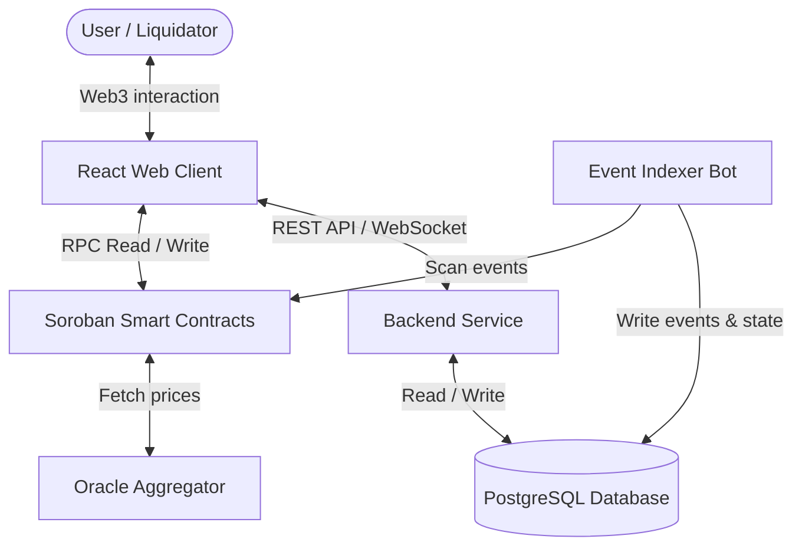

# Architecture Overview Diagram

This diagram displays the unified modular and data flow blueprint of the UdonFi V2 system.

```mermaid
graph TD
    User([User / Liquidator]) <--> |Web3 interaction| FE[React Web Client]
    FE <--> |RPC Read / Write| SC[Soroban Smart Contracts]
    FE <--> |REST API / WebSocket| BE[Backend Service]
    Indexer[Event Indexer Bot] --> |Scan events| SC
    Indexer --> |Write events & state| DB[(PostgreSQL Database)]
    BE <--> |Read / Write| DB
    SC <--> |Fetch prices| Oracle[Oracle Aggregator]
```
