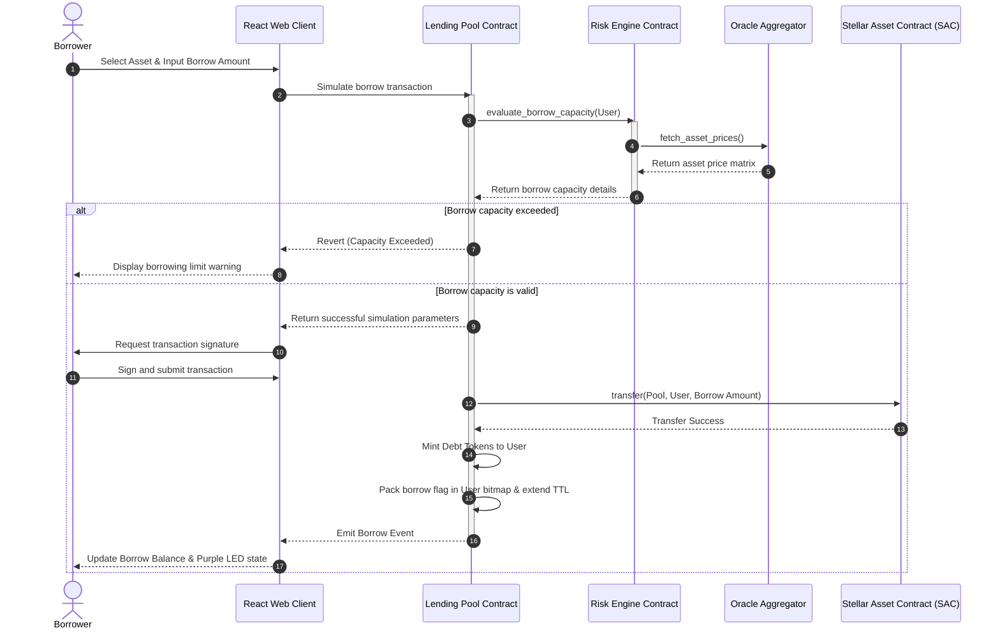

# Borrow Sequence Diagram

This diagram displays the workflow of borrowing capital against active collateral.

```mermaid
sequenceDiagram
    autonumber
    actor User as Borrower
    participant UI as React Web Client
    participant Pool as Lending Pool Contract
    participant Risk as Risk Engine Contract
    participant Oracle as Oracle Aggregator
    participant Token as Stellar Asset Contract (SAC)
    
    User->>UI: Select Asset & Input Borrow Amount
    UI->>Pool: Simulate borrow transaction
    activate Pool
    Pool->>Risk: evaluate_borrow_capacity(User)
    activate Risk
    Risk->>Oracle: fetch_asset_prices()
    Oracle-->>Risk: Return asset price matrix
    Risk-->>Pool: Return borrow capacity details
    deactivate Risk
    
    alt Borrow capacity exceeded
        Pool-->>UI: Revert (Capacity Exceeded)
        UI-->>User: Display borrowing limit warning
    else Borrow capacity is valid
        Pool-->>UI: Return successful simulation parameters
        UI->>User: Request transaction signature
        User->>UI: Sign and submit transaction
        Pool->>Token: transfer(Pool, User, Borrow Amount)
        Token-->>Pool: Transfer Success
        Pool->>Pool: Mint Debt Tokens to User
        Pool->>Pool: Pack borrow flag in User bitmap & extend TTL
        Pool-->>UI: Emit Borrow Event
        deactivate Pool
        UI-->>User: Update Borrow Balance & Purple LED state
    end
```
