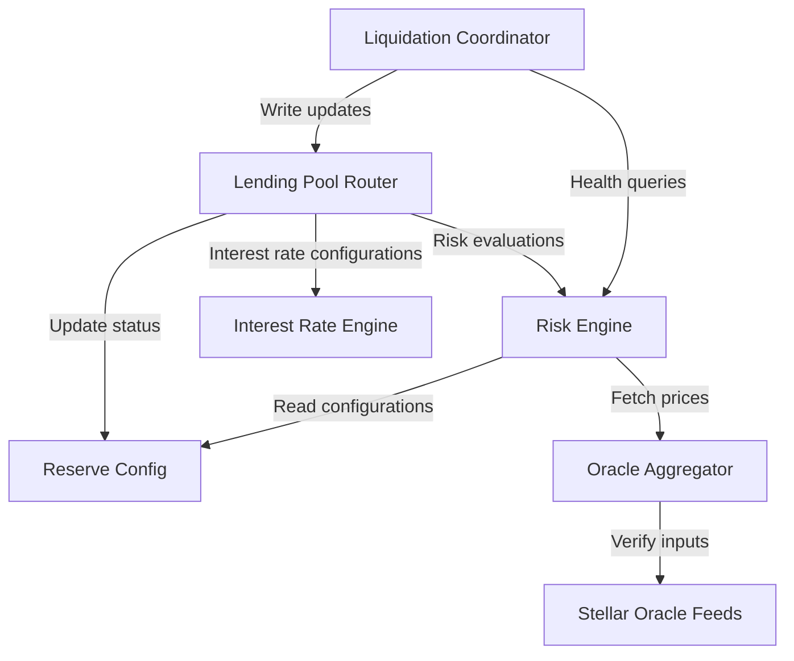

# Component Diagram

This diagram displays the relationship and dependencies between on-chain modular smart contracts.

```mermaid
graph TD
    Pool[Lending Pool Router] -->|Risk evaluations| Risk[Risk Engine]
    Pool -->|Interest rate configurations| Interest[Interest Rate Engine]
    Pool -->|Update status| Reserve[Reserve Config]
    
    Liq[Liquidation Coordinator] -->|Health queries| Risk
    Liq -->|Write updates| Pool
    
    Risk -->|Fetch prices| Oracle[Oracle Aggregator]
    Risk -->|Read configurations| Reserve
    
    Oracle -->|Verify inputs| Feed[Stellar Oracle Feeds]
```
