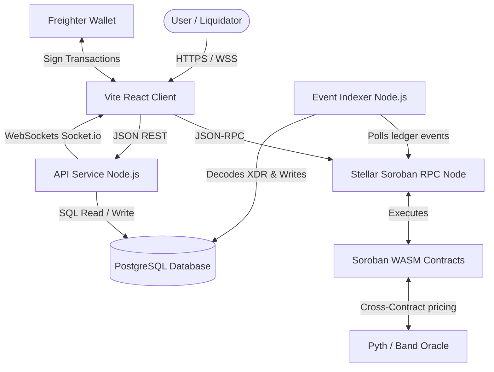

# Container Diagram

This diagram outlines the major runtime containers, technical stacks, databases, and communication protocols.

```mermaid
graph TB
    User([User / Liquidator]) -->|HTTPS / WSS| Web[Vite React Client]
    Wallet[Freighter Wallet] <-->|Sign Transactions| Web
    
    Web -->|JSON-RPC| RPC[Stellar Soroban RPC Node]
    RPC <-->|Executes| Contracts[Soroban WASM Contracts]
    
    Web -->|JSON REST| Backend[API Service Node.js]
    
    Indexer[Event Indexer Node.js] -->|Polls ledger events| RPC
    Indexer -->|Decodes XDR & Writes| DB[(PostgreSQL Database)]
    
    Backend -->|SQL Read / Write| DB
    Backend -->|WebSockets Socket.io| Web
    
    Contracts <-->|Cross-Contract pricing| Pyth[Pyth / Band Oracle]
```
