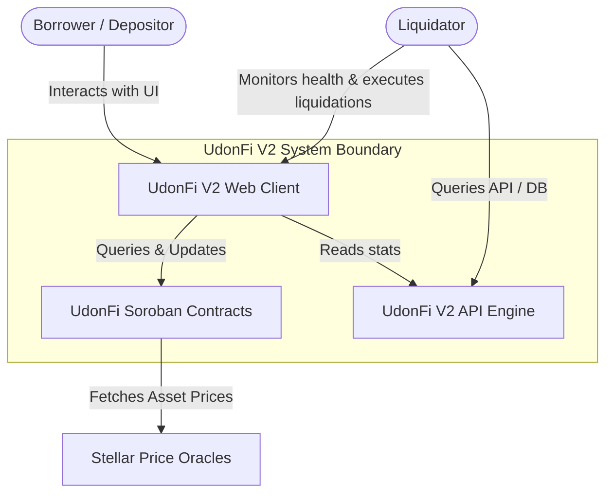

# Context Diagram

This diagram displays UdonFi V2's high-level boundaries and key external actors/systems.

```mermaid
graph TB
    User([Borrower / Depositor]) -->|Interacts with UI| UI[UdonFi V2 Web Client]
    Liquidator([Liquidator]) -->|Monitors health & executes liquidations| UI
    Liquidator -->|Queries API / DB| API[UdonFi V2 API Engine]
    
    UI -->|Queries & Updates| SC[UdonFi Soroban Contracts]
    UI -->|Reads stats| API
    
    SC -->|Fetches Asset Prices| Oracle[Stellar Price Oracles]
    
    subgraph UdonFi V2 System Boundary
        UI
        API
        SC
    end
```
