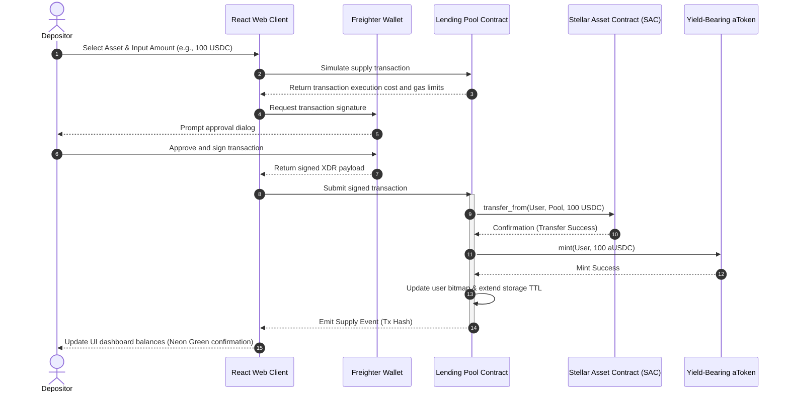

# Deposit Sequence Diagram

This diagram displays the workflow of supplying capital to UdonFi V2 reserves.

```mermaid
sequenceDiagram
    autonumber
    actor User as Depositor
    participant UI as React Web Client
    participant Wallet as Freighter Wallet
    participant Pool as Lending Pool Contract
    participant Token as Stellar Asset Contract (SAC)
    participant aToken as Yield-Bearing aToken
    
    User->>UI: Select Asset & Input Amount (e.g., 100 USDC)
    UI->>Pool: Simulate supply transaction
    Pool-->>UI: Return transaction execution cost and gas limits
    UI->>Wallet: Request transaction signature
    Wallet-->>User: Prompt approval dialog
    User->>Wallet: Approve and sign transaction
    Wallet-->>UI: Return signed XDR payload
    UI->>Pool: Submit signed transaction
    activate Pool
    Pool->>Token: transfer_from(User, Pool, 100 USDC)
    Token-->>Pool: Confirmation (Transfer Success)
    Pool->>aToken: mint(User, 100 aUSDC)
    aToken-->>Pool: Mint Success
    Pool->>Pool: Update user bitmap & extend storage TTL
    Pool-->>UI: Emit Supply Event (Tx Hash)
    deactivate Pool
    UI-->>User: Update UI dashboard balances (Neon Green confirmation)
```
