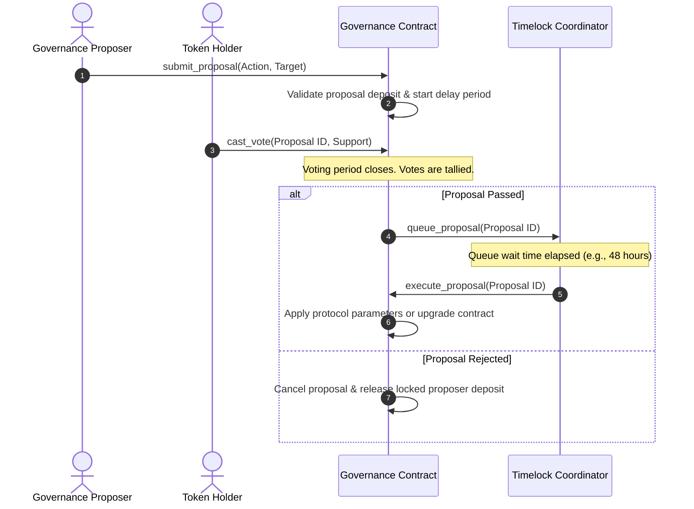

# Governance Sequence Diagram

This diagram displays the proposal submission, voting, timelock queue, and execution flow.

```mermaid
sequenceDiagram
    autonumber
    actor Proposer as Governance Proposer
    actor Voter as Token Holder
    participant Gov as Governance Contract
    participant TL as Timelock Coordinator
    
    Proposer->>Gov: submit_proposal(Action, Target)
    Gov->>Gov: Validate proposal deposit & start delay period
    
    Voter->>Gov: cast_vote(Proposal ID, Support)
    Note over Gov: Voting period closes. Votes are tallied.
    
    alt Proposal Passed
        Gov->>TL: queue_proposal(Proposal ID)
        Note over TL: Queue wait time elapsed (e.g., 48 hours)
        TL->>Gov: execute_proposal(Proposal ID)
        Gov->>Gov: Apply protocol parameters or upgrade contract
    else Proposal Rejected
        Gov->>Gov: Cancel proposal & release locked proposer deposit
    end
```
