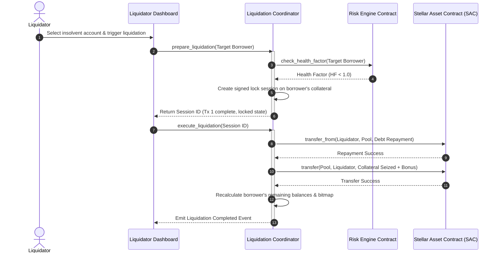

# Liquidation Sequence Diagram

This diagram displays the dual-phase (2-step) execution workflow of vault debt liquidations.

```mermaid
sequenceDiagram
    autonumber
    actor Liq as Liquidator
    participant UI as Liquidator Dashboard
    participant Contracts as Liquidation Coordinator
    participant Risk as Risk Engine Contract
    participant Token as Stellar Asset Contract (SAC)
    
    Liq->>UI: Select insolvent account & trigger liquidation
    UI->>Contracts: prepare_liquidation(Target Borrower)
    activate Contracts
    Contracts->>Risk: check_health_factor(Target Borrower)
    Risk-->>Contracts: Health Factor (HF < 1.0)
    Contracts->>Contracts: Create signed lock session on borrower's collateral
    Contracts-->>UI: Return Session ID (Tx 1 complete, locked state)
    deactivate Contracts
    
    UI->>Contracts: execute_liquidation(Session ID)
    activate Contracts
    Contracts->>Token: transfer_from(Liquidator, Pool, Debt Repayment)
    Token-->>Contracts: Repayment Success
    Contracts->>Token: transfer(Pool, Liquidator, Collateral Seized + Bonus)
    Token-->>Contracts: Transfer Success
    Contracts->>Contracts: Recalculate borrower's remaining balances & bitmap
    Contracts-->>UI: Emit Liquidation Completed Event
    deactivate Contracts
```
