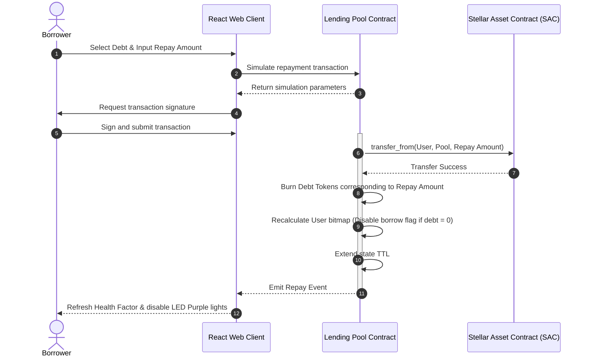

# Repay Sequence Diagram

This diagram displays the workflow of paying back borrowed asset debt.

```mermaid
sequenceDiagram
    autonumber
    actor User as Borrower
    participant UI as React Web Client
    participant Pool as Lending Pool Contract
    participant Token as Stellar Asset Contract (SAC)
    
    User->>UI: Select Debt & Input Repay Amount
    UI->>Pool: Simulate repayment transaction
    Pool-->>UI: Return simulation parameters
    UI->>User: Request transaction signature
    User->>UI: Sign and submit transaction
    activate Pool
    Pool->>Token: transfer_from(User, Pool, Repay Amount)
    Token-->>Pool: Transfer Success
    Pool->>Pool: Burn Debt Tokens corresponding to Repay Amount
    Pool->>Pool: Recalculate User bitmap (Disable borrow flag if debt = 0)
    Pool->>Pool: Extend state TTL
    Pool-->>UI: Emit Repay Event
    deactivate Pool
    UI-->>User: Refresh Health Factor & disable LED Purple lights
```
