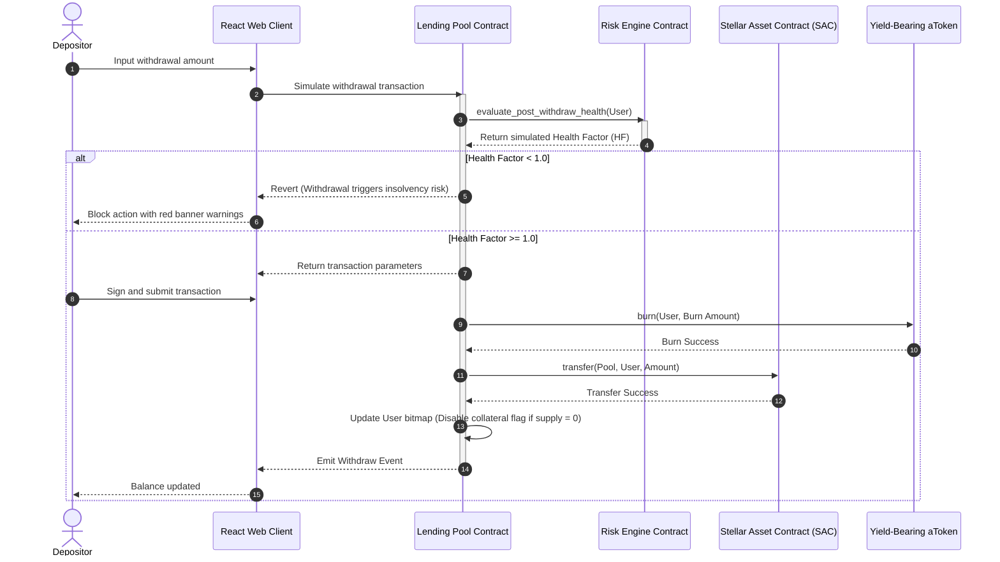

# Withdraw Sequence Diagram

This diagram displays the workflow of withdrawing supplied capital from the protocol.

```mermaid
sequenceDiagram
    autonumber
    actor User as Depositor
    participant UI as React Web Client
    participant Pool as Lending Pool Contract
    participant Risk as Risk Engine Contract
    participant Token as Stellar Asset Contract (SAC)
    participant aToken as Yield-Bearing aToken
    
    User->>UI: Input withdrawal amount
    UI->>Pool: Simulate withdrawal transaction
    activate Pool
    Pool->>Risk: evaluate_post_withdraw_health(User)
    activate Risk
    Risk-->>Pool: Return simulated Health Factor (HF)
    deactivate Risk
    
    alt Health Factor < 1.0
        Pool-->>UI: Revert (Withdrawal triggers insolvency risk)
        UI-->>User: Block action with red banner warnings
    else Health Factor >= 1.0
        Pool-->>UI: Return transaction parameters
        User->>UI: Sign and submit transaction
        Pool->>aToken: burn(User, Burn Amount)
        aToken-->>Pool: Burn Success
        Pool->>Token: transfer(Pool, User, Amount)
        Token-->>Pool: Transfer Success
        Pool->>Pool: Update User bitmap (Disable collateral flag if supply = 0)
        Pool-->>UI: Emit Withdraw Event
        deactivate Pool
        UI-->>User: Balance updated
    end
```
