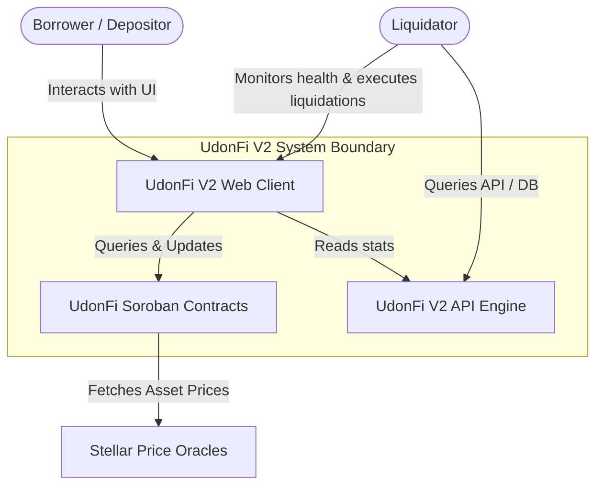
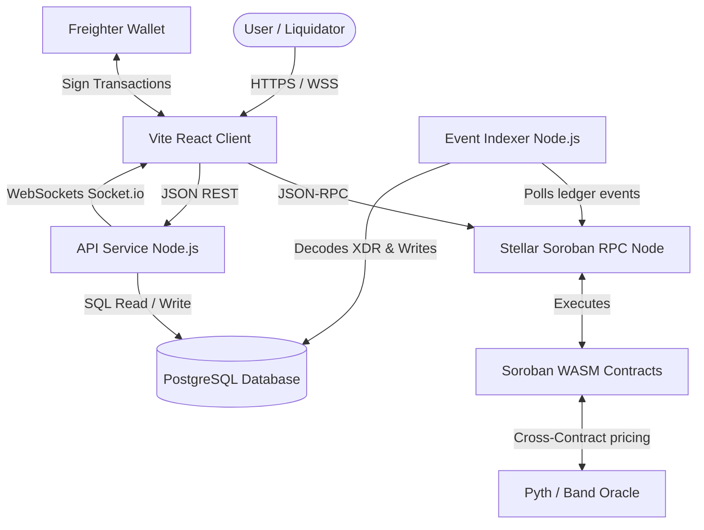
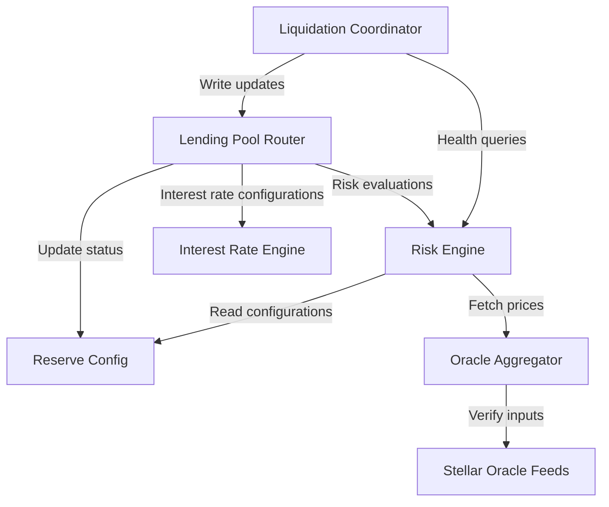

# 03 - C4 Model Specification

This document provides a detailed layout of the UdonFi V2 system using the C4 model for software architecture.

## 1. Level 1: System Context Diagram

The System Context Diagram shows how users, liquidators, and external systems interact with the UdonFi V2 protocol.



---

## 2. Level 2: Container Diagram

The Container Diagram details the tech stack, data stores, and communication pathways.



---

## 3. Level 3: Component Diagram (Smart Contracts)

This diagram outlines how the modular smart contracts interact on-chain.



---

## 4. Level 4: Deployment Diagram

This diagram displays the physical deployment infrastructure of the production protocol.

```mermaid
graph TB
    subgraph Client Environment
        Browser[User Browser]
        Freighter[Freighter Wallet Extension]
    end
    
    subgraph Cloud Infrastructure (AWS / GCP)
        LB[Load Balancer]
        
        subgraph ECS / Kubernetes Cluster
            BE_Instance[API Backend Containers]
            Idx_Instance[Indexer Bot Daemon]
        end
        
        subgraph Database Tier
            Postgres[(RDS PostgreSQL Master)]
            Replica[(RDS PostgreSQL Read Replica)]
            Redis[(Redis Cache Cluster)]
        end
    end
    
    subgraph Stellar Network
        RPC_Node[Soroban RPC Endpoint]
        Ledger[(Stellar Ledger State)]
    end
    
    Browser -->|HTTPS| LB
    Browser -->|JSON-RPC| RPC_Node
    LB --> BE_Instance
    BE_Instance --> Postgres
    BE_Instance --> Redis
    Idx_Instance --> RPC_Node
    Idx_Instance --> Postgres
    Postgres -->|Replication| Replica
    RPC_Node <--> Ledger
```
