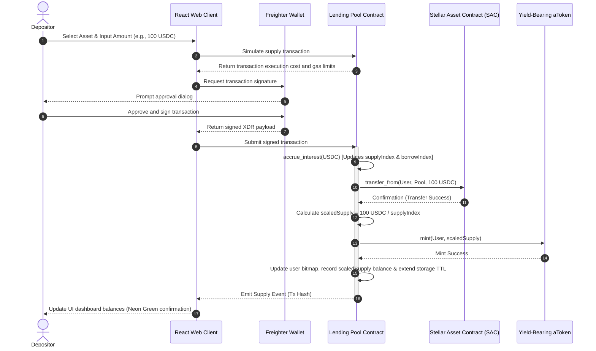
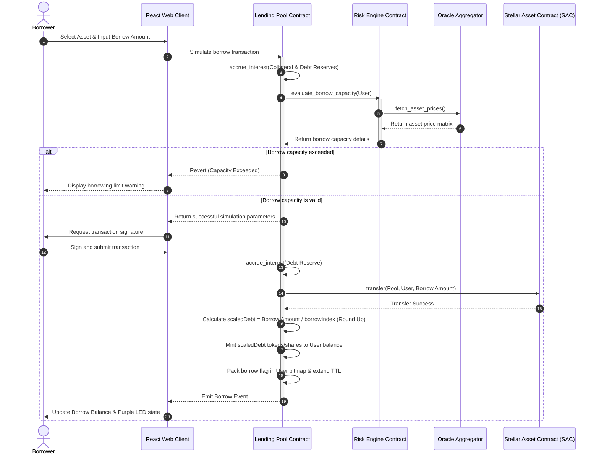
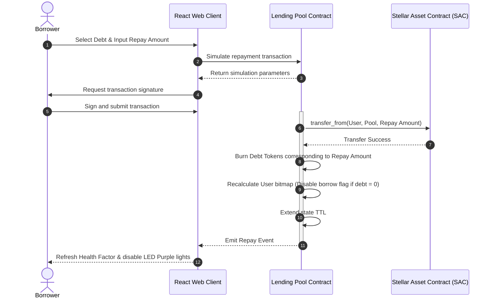
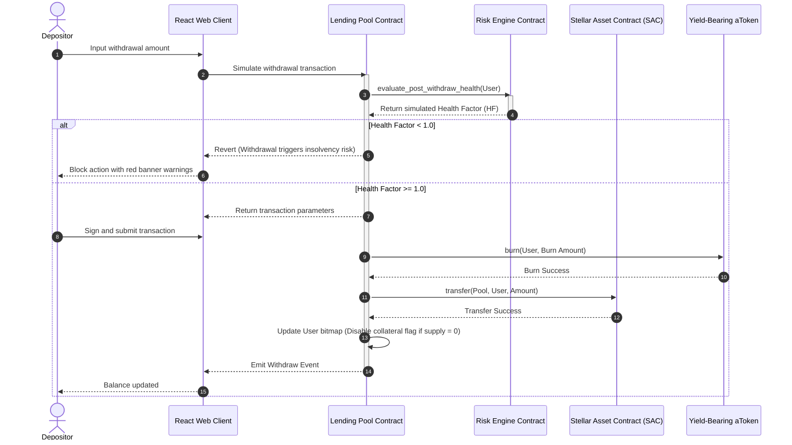
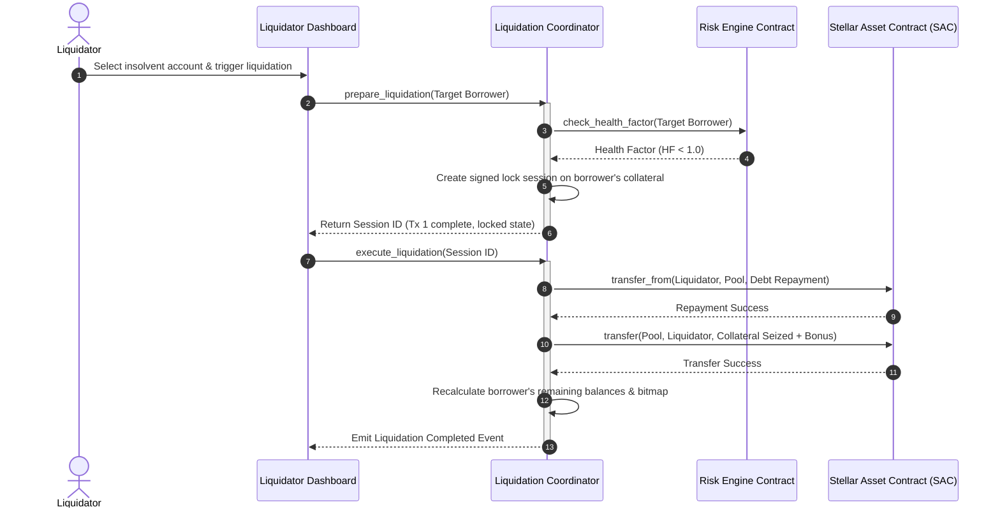
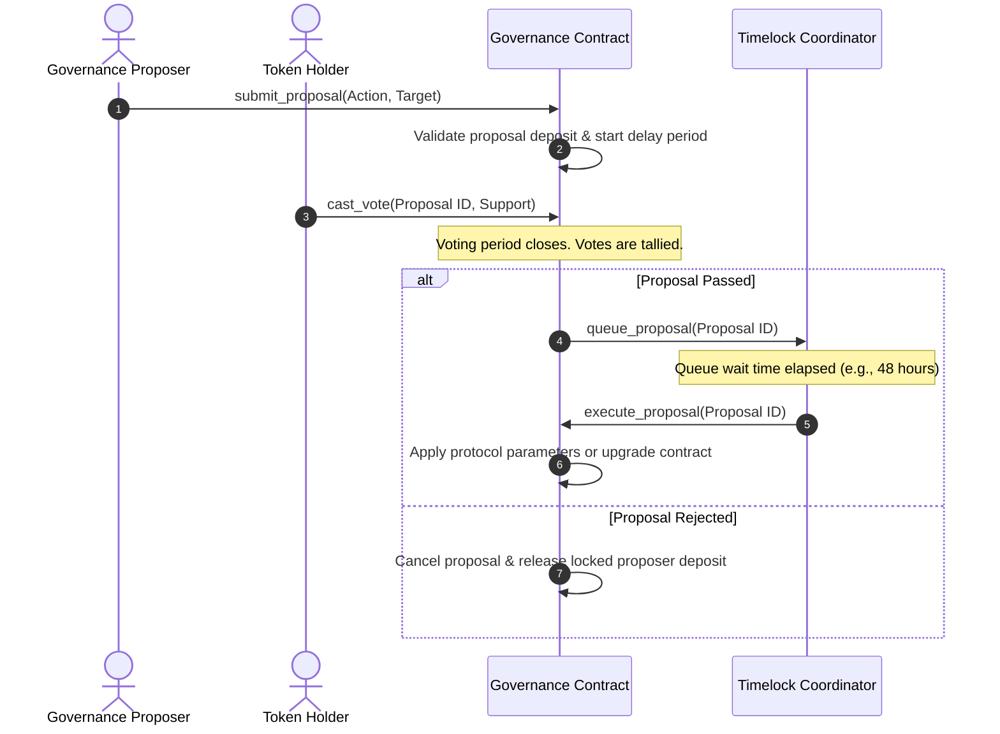

# 04 - Business Sequence Flows

This document details the step-by-step transaction lifecycles and business workflows of UdonFi V2 using sequence diagrams.

## 1. Deposit (Supply) Sequence

---

## 2. Borrow Sequence

---

## 3. Repay Sequence

---

## 4. Withdraw Sequence

---

## 5. Liquidation Sequence (2-Step)

---

## 6. Governance Sequence

