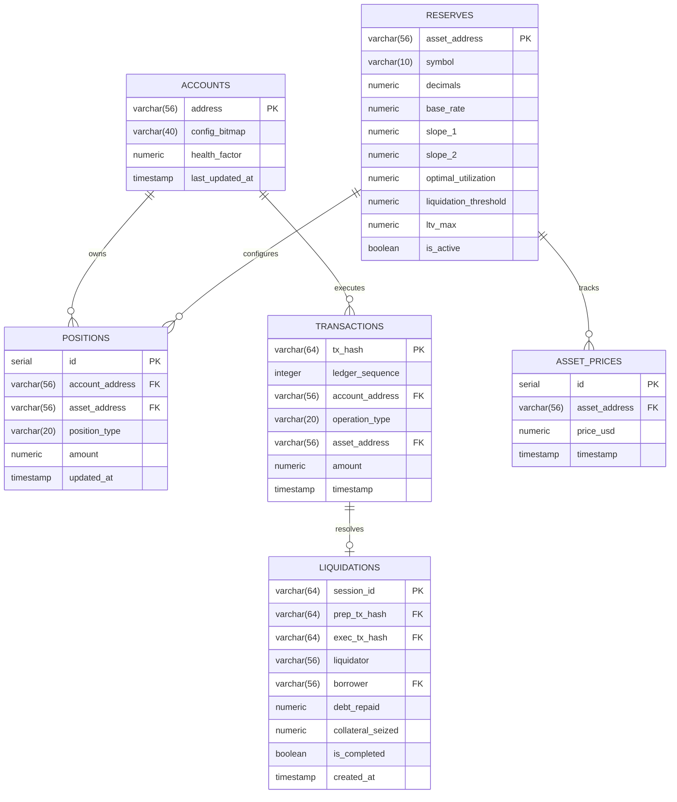

# 07 - Database Schema Design

To transition from the Firebase prototype to a production-grade system, UdonFi V2 utilizes PostgreSQL to ensure relational integrity, ACID transactions, and support historical analytic calculations.

## 1. Entity-Relationship Diagram (ERD)

The database schema models the on-chain ledger configurations, user vaults, event history, and pricing parameters.



---

## 2. Table Schemas (DDL Statements)

```sql
-- Disable pauses and enable transactions
BEGIN;

CREATE TABLE accounts (
    address VARCHAR(56) PRIMARY KEY,
    config_bitmap VARCHAR(40) NOT NULL DEFAULT '0',
    health_factor NUMERIC(28, 18) NOT NULL DEFAULT 999999,
    last_updated_at TIMESTAMP NOT NULL DEFAULT NOW()
);

CREATE TABLE reserves (
    asset_address VARCHAR(56) PRIMARY KEY,
    symbol VARCHAR(10) NOT NULL,
    decimals INT NOT NULL DEFAULT 7,
    base_rate NUMERIC(10, 4) NOT NULL,
    slope_1 NUMERIC(10, 4) NOT NULL,
    slope_2 NUMERIC(10, 4) NOT NULL,
    optimal_utilization NUMERIC(5, 4) NOT NULL DEFAULT 0.8000,
    liquidation_threshold NUMERIC(5, 4) NOT NULL,
    ltv_max NUMERIC(5, 4) NOT NULL,
    is_active BOOLEAN NOT NULL DEFAULT TRUE
);

CREATE TABLE positions (
    id SERIAL PRIMARY KEY,
    account_address VARCHAR(56) NOT NULL REFERENCES accounts(address) ON DELETE CASCADE,
    asset_address VARCHAR(56) NOT NULL REFERENCES reserves(asset_address),
    position_type VARCHAR(20) NOT NULL CHECK (position_type IN ('collateral', 'debt')),
    amount NUMERIC(28, 18) NOT NULL DEFAULT 0,
    updated_at TIMESTAMP NOT NULL DEFAULT NOW()
);

CREATE TABLE transactions (
    tx_hash VARCHAR(64) PRIMARY KEY,
    ledger_sequence INT NOT NULL,
    account_address VARCHAR(56) NOT NULL REFERENCES accounts(address),
    operation_type VARCHAR(20) NOT NULL CHECK (operation_type IN ('supply', 'withdraw', 'borrow', 'repay', 'liquidate')),
    asset_address VARCHAR(56) REFERENCES reserves(asset_address),
    amount NUMERIC(28, 18) NOT NULL,
    timestamp TIMESTAMP NOT NULL
);

CREATE TABLE liquidations (
    session_id VARCHAR(64) PRIMARY KEY,
    prep_tx_hash VARCHAR(64) NOT NULL REFERENCES transactions(tx_hash),
    exec_tx_hash VARCHAR(64) REFERENCES transactions(tx_hash),
    liquidator VARCHAR(56) NOT NULL,
    borrower VARCHAR(56) NOT NULL REFERENCES accounts(address),
    debt_repaid NUMERIC(28, 18) NOT NULL,
    collateral_seized NUMERIC(28, 18) NOT NULL,
    is_completed BOOLEAN NOT NULL DEFAULT FALSE,
    created_at TIMESTAMP NOT NULL DEFAULT NOW()
);

CREATE TABLE asset_prices (
    id SERIAL PRIMARY KEY,
    asset_address VARCHAR(56) NOT NULL REFERENCES reserves(asset_address),
    price_usd NUMERIC(28, 18) NOT NULL,
    timestamp TIMESTAMP NOT NULL
);

COMMIT;
```

---

## 3. Indexing & Optimization Strategy

To support high-throughput, real-time analytics queries:

### A. Performance Indexes
- **Account Health Queries**: Index on `health_factor` to speed up candidate sorting for liquidations:
  ```sql
  CREATE INDEX idx_accounts_health ON accounts(health_factor) WHERE health_factor < 1.0;
  ```
- **Active Vault Positions**: Indexes on position ownership lookups:
  ```sql
  CREATE INDEX idx_positions_lookup ON positions(account_address, position_type);
  ```
- **Time-Series Pricing**: Composite index on asset price histories:
  ```sql
  CREATE INDEX idx_prices_time ON asset_prices(asset_address, timestamp DESC);
  ```

### B. Partitioning Strategy
As the protocol processes millions of events over time, the `transactions` and `asset_prices` tables will grow rapidly.
- We implement **monthly range partitioning** on the `transactions` table based on the `timestamp` column to maintain fast index scans.
- Old price history data (older than 90 days) is moved to compressed cold-storage tables to keep active working sets in memory.
