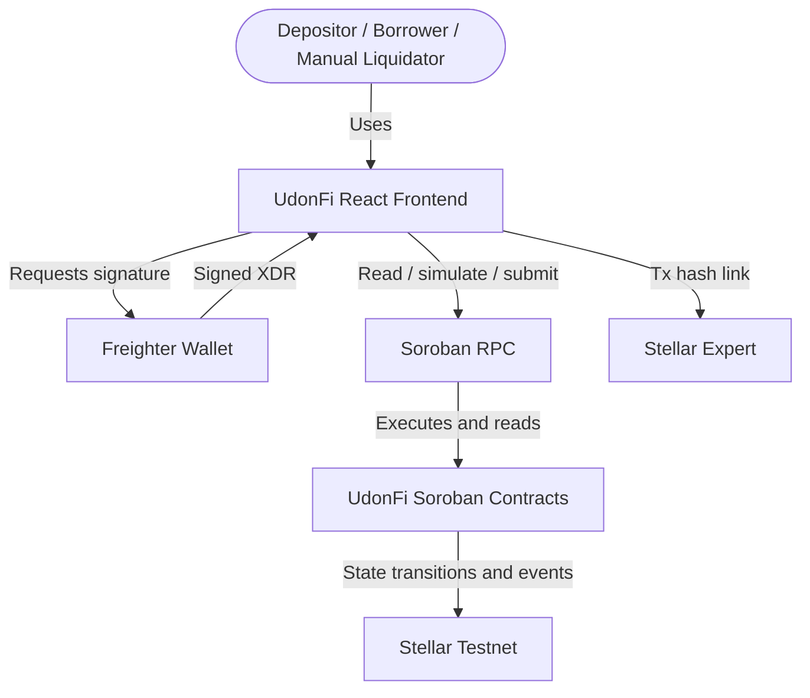
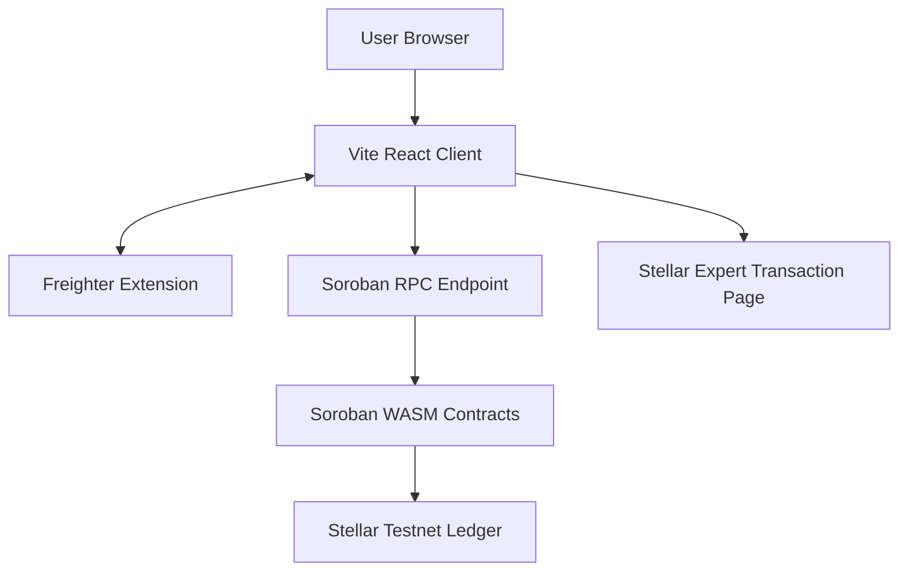
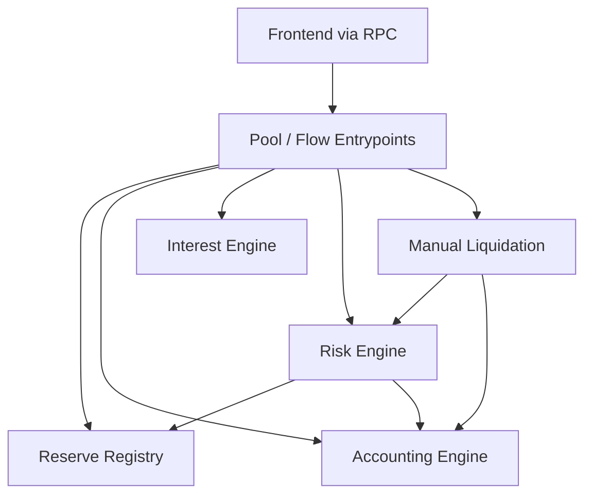
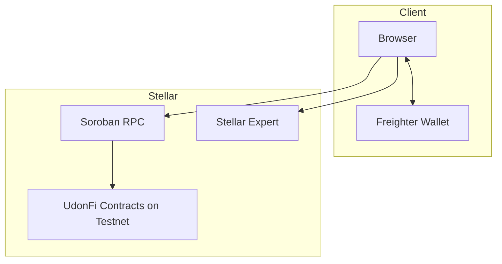

# 03 - C4 Model Specification

This C4 model reflects the current UdonFi V2 MVP contract-first demo.

## 1. Level 1: System Context

## 2. Level 2: Container Diagram

## 3. Level 3: Smart Contract Components

## 4. Deployment Model for MVP

