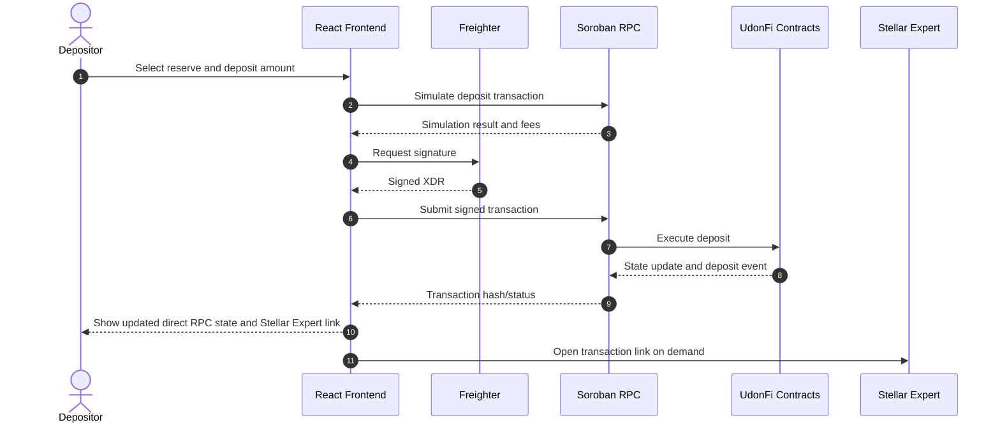
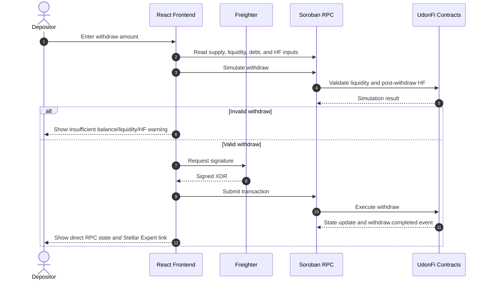
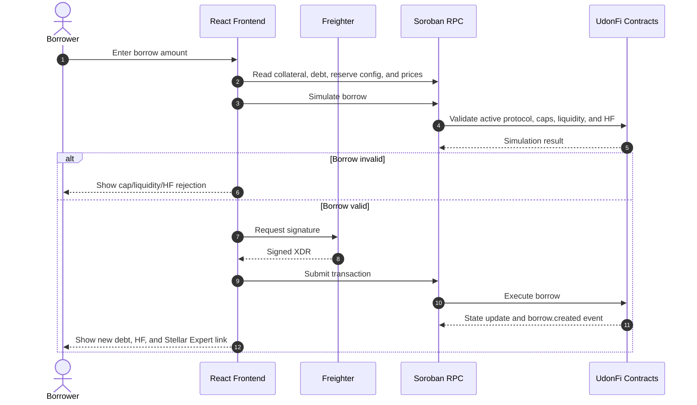
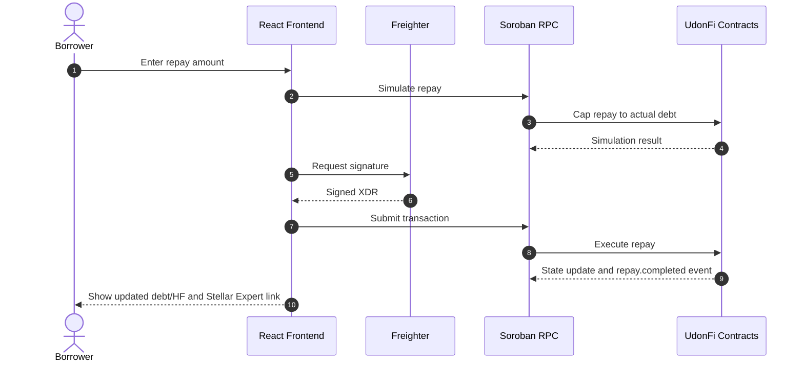
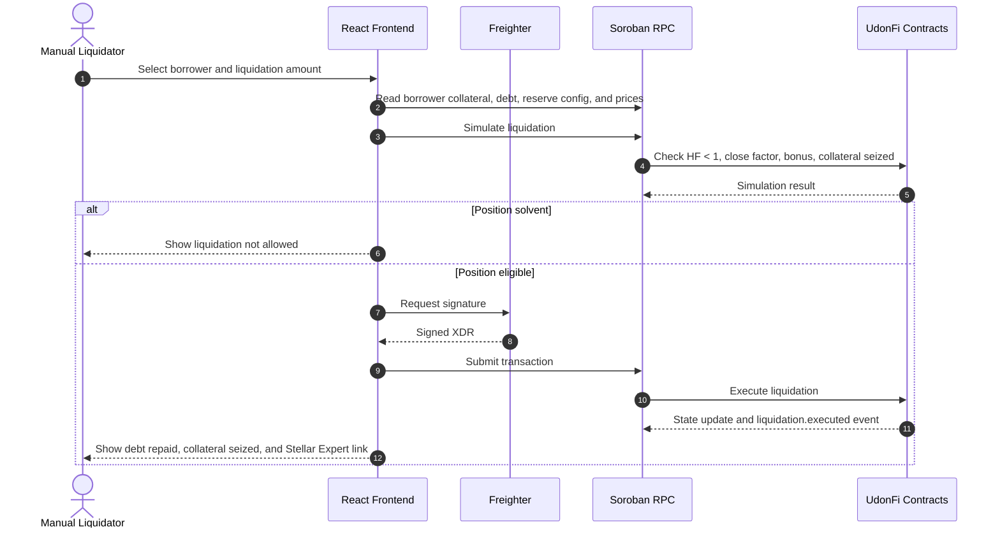

# 04 - Business Sequence Flows

These flows describe the current MVP path: frontend, Freighter, Soroban RPC, smart contracts, Stellar Testnet, and Stellar Expert links. No off-chain service is required.

## 1. Deposit Sequence

## 2. Withdraw Sequence

## 3. Borrow Sequence

## 4. Repay Sequence

## 5. Manual Liquidation Sequence

