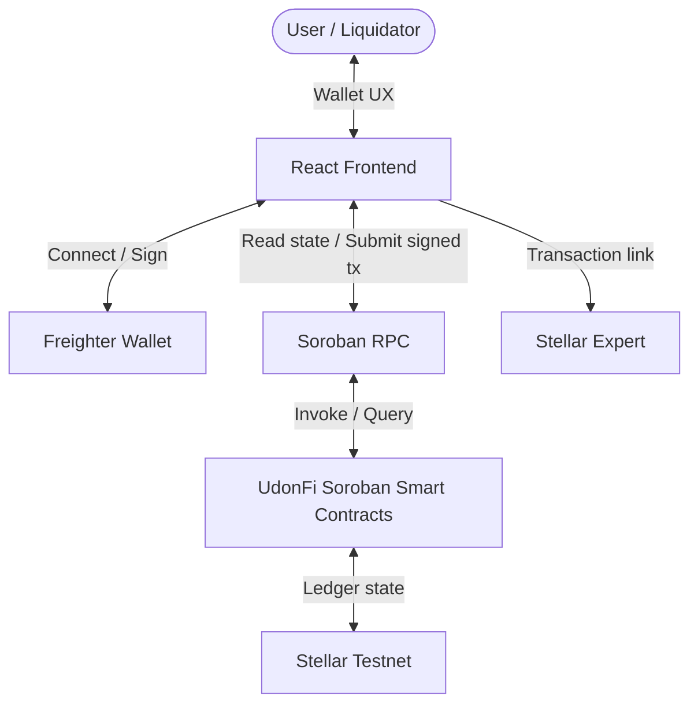

# Architecture Overview Diagram

This diagram shows the current UdonFi V2 MVP architecture.

```mermaid
graph TD
    User([User / Liquidator]) <--> |Wallet UX| FE[React Frontend]
    FE <--> |Connect / Sign| Wallet[Freighter Wallet]
    FE <--> |Read state / Submit signed tx| RPC[Soroban RPC]
    RPC <--> |Invoke / Query| SC[UdonFi Soroban Smart Contracts]
    SC <--> |Ledger state| Stellar[Stellar Testnet]
    FE --> |Transaction link| Expert[Stellar Expert]
```
