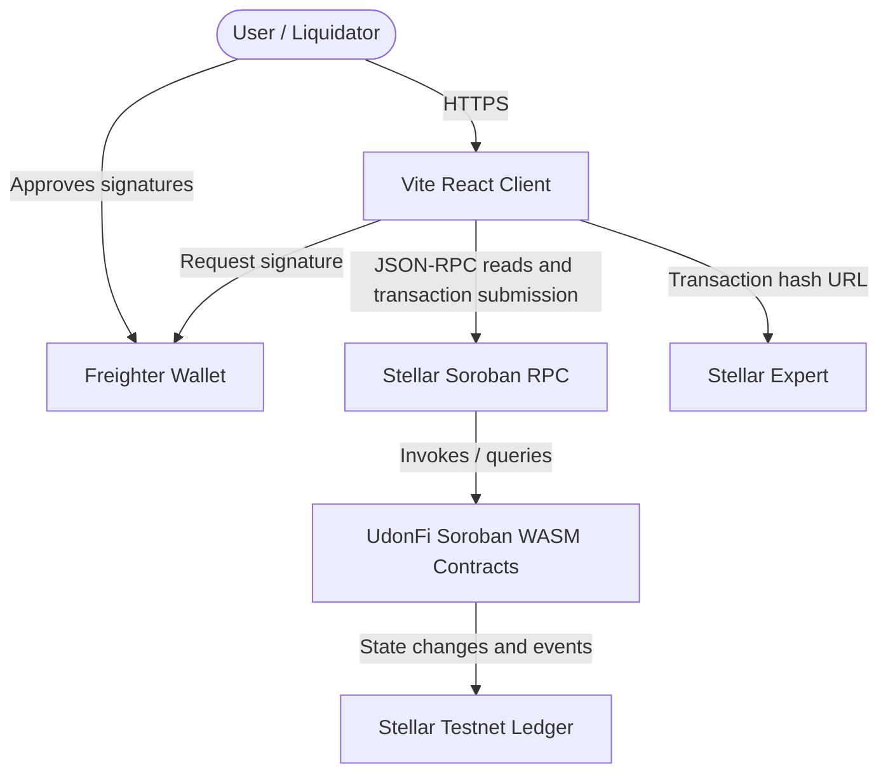

# Container Diagram

This diagram outlines the current MVP runtime containers. Post-MVP services are intentionally excluded from the required demo path.

Production containers may be defined later if off-chain services return to scope.
