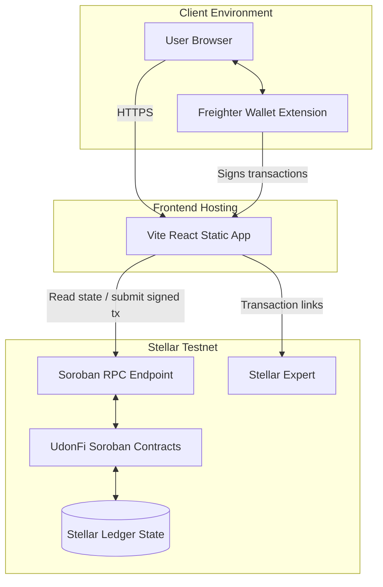

# Deployment Diagram

This diagram shows the MVP testnet deployment topology.

```mermaid
graph TB
    subgraph Client Environment
        Browser[User Browser]
        Freighter[Freighter Wallet Extension]
    end

    subgraph Frontend Hosting
        FE[Vite React Static App]
    end

    subgraph Stellar Testnet
        RPC[Soroban RPC Endpoint]
        Contracts[UdonFi Soroban Contracts]
        Ledger[(Stellar Ledger State)]
        Expert[Stellar Expert]
    end

    Browser -->|HTTPS| FE
    Browser <--> Freighter
    FE -->|Read state / submit signed tx| RPC
    Freighter -->|Signs transactions| FE
    RPC <--> Contracts
    Contracts <--> Ledger
    FE -->|Transaction links| Expert
```

Production off-chain service containers are outside this MVP deployment diagram.
