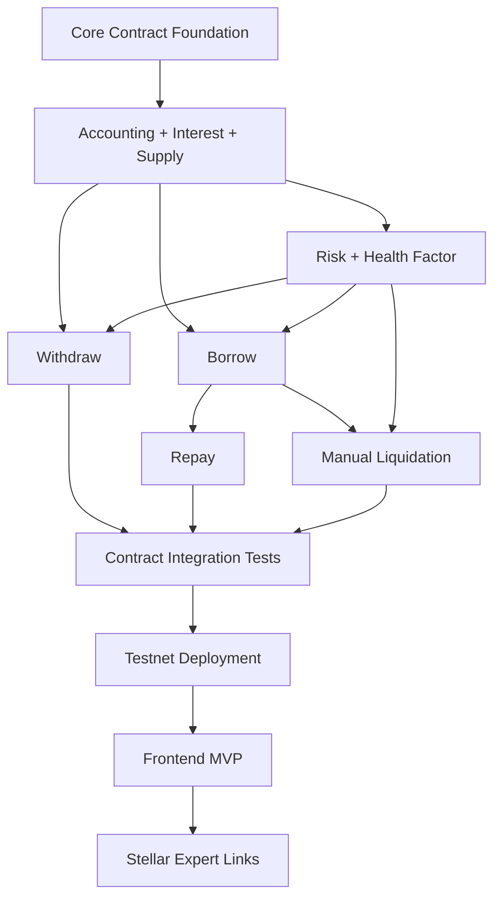

# 04 - Task Dependency & Critical Path

This document defines the dependency path for the simplified UdonFi V2 MVP. The MVP does not depend on an event indexer, liquidation bot, backend analytics API, PostgreSQL event sync, queue system, background workers, checkpoint/replay, or sync lag middleware.

---

## 1. MVP Epic Dependencies



---

## 2. MVP Task Dependency Registry

| Task Area | Direct Dependencies | MVP Status |
|:---|:---|:---|
| Core Contract Foundation | None | Required |
| Reserve Registry + Lifecycle | Core Contract Foundation | Required |
| Accounting Engine | Reserve Registry + Lifecycle | Required |
| Interest Engine | Accounting Engine | Required |
| Deposit | Accounting Engine, Lifecycle | Required |
| Withdraw | Deposit, Risk Engine, Accounting Engine | Required |
| Borrow | Deposit, Interest Engine, Risk Engine, Accounting Engine | Required |
| Repay | Borrow, Accounting Engine | Required |
| Risk Engine | Reserve risk config, price input/mock price provider | Required |
| Manual Liquidation | Borrow, Risk Engine, Accounting Engine | Required |
| Contract Integration Tests | Deposit, Withdraw, Borrow, Repay, Risk, Manual Liquidation | Required |
| Testnet Deployment | Passing contract tests | Required |
| Frontend MVP | Testnet contract IDs, Soroban RPC URL, Freighter | Required |
| Stellar Expert Links | Submitted transaction hash | Required |

---

## 3. MVP Critical Path

```txt
Core Contract Foundation
  -> Accounting + Interest + Supply
  -> Withdraw + Borrow + Repay
  -> Risk + Manual Liquidation
  -> Contract Integration Tests
  -> Testnet Deployment
  -> Frontend MVP + Freighter + Stellar Expert Links
```

Any delay in this chain delays the demo. Post-MVP backend/indexer work must not block this path.

---

## 4. Parallel Workstreams

1. **Smart Contracts**
   - Complete accounting, interest, deposit, withdraw, borrow, repay, risk, manual liquidation, and contract tests.

2. **Frontend**
   - Build Freighter connection and Soroban RPC integration against mocked contract IDs first, then connect to Testnet IDs after deployment.

3. **Deployment**
   - Prepare Testnet build/deploy scripts, reserve initialization steps, and Stellar Expert link formatting.

---

## 5. Post-MVP Workstreams

The following tracks are preserved but removed from the MVP critical path:

- Event Indexer: Future Work.
- Backend API / Analytics: Future Work.
- Automated Liquidation Bot: Future Work.
- PostgreSQL event sync and single-writer policy: Future Work.
- Real-time dashboard sync and sync lag strategy: Future Work.
- Background worker, queue, checkpoint, and replay systems: Future Work.

References:

- [Future Work: Indexer Architecture](../future-work/indexer-architecture.md)
- [Future Work: Liquidation Bot](../future-work/liquidation-bot.md)
- [Future Work: Backend Analytics](../future-work/backend-analytics.md)
