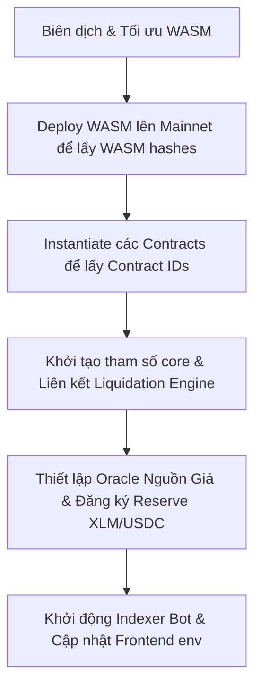

# 🍜 UdonFi — Plan de Triển Khai Mainnet (Stellar Soroban Upgrade Plan)

Tài liệu này cung cấp kế hoạch chi tiết, từng bước để chuyển đổi hệ thống **UdonFi Lending Protocol** từ môi trường Testnet sang **Stellar Soroban Mainnet**. Kế hoạch được thiết kế bởi Senior Web3 Architect, đảm bảo tính bảo mật, tối ưu hóa chi phí vận hành sổ cái (Ledger fees) và giảm thiểu tối đa rủi ro hệ thống.

---

## 📌 Tổng Quan Kiến Trúc & Trạng Thái Hiện Tại
UdonFi là giao thức lending thế chấp kết hợp các giải pháp kỹ thuật đặc thù Soroban:
1. **Smart Contracts (Rust/WASM):** 7 hợp đồng thông minh lõi xử lý hoạt động nạp/vay/thanh lý, quản lý trạng thái qua Bitmap Matrix 128-bit và cơ chế thanh lý 2 bước.
2. **Indexer Bot (NodeJS):** Polling sự kiện on-chain, lưu trữ vào Firestore và phát WebSocket thời gian thực.
3. **Frontend (Vite/React/TS):** Giao diện tương tác người dùng, hiển thị biểu đồ dynamic Kinked APY Curve, LED Bitmap.

---

## 🛠️ CHI TIẾT CÁC BƯỚC NÂNG CẤP LÊN MAINNET

### 1. Smart Contracts: Tối Ưu Hóa & Quản Lý Bộ Nhớ Sổ Cái (Ledger Management)
Soroban có quy định khắt khe về phí lưu trữ (Storage Fees), giới hạn kích thước hợp đồng (Contract Size Limit - tối đa 64KB nén), và giới hạn CPU Instructions.

*   **Tối ưu kích thước WASM:**
    Không triển khai trực tiếp file WASM sinh ra từ `cargo build --release` lên Mainnet. Cần phải tối ưu hóa bytecode để giảm thiểu gas deploy và tránh lỗi kích thước vượt giới hạn:
    ```bash
    # Biên dịch hợp đồng
    cargo build --target wasm32v1-none --release

    # Tối ưu hóa file WASM bằng Stellar CLI (sử dụng wasm-opt dưới nền)
    stellar contract optimize --wasm target/wasm32v1-none/release/udonfi_lending_pool.wasm
    ```
    Lệnh này sẽ tạo ra các file `.optimized.wasm` có kích thước nhỏ hơn đáng kể (giảm ~40-60%).

*   **Thiết lập chính sách Gia hạn TTL (Time-To-Live Storage):**
    Soroban tự động trục xuất (evict) dữ liệu khi hết thời hạn sống (TTL). Trên Testnet, dữ liệu có thể khôi phục qua Friendbot hoặc redeploy, nhưng trên Mainnet, dữ liệu bị trục xuất sẽ làm đóng băng vị thế nợ của người dùng, gây thất thoát tài sản nghiêm trọng.
    - **Instance Storage:** Chứa mã hợp đồng và các cấu hình reserve. Cần được kéo dài TTL định kỳ.
    - **User Storage (Persistent):** Chứa thông tin số dư nạp/vay và bit-matrix.
    - **Chiến lược:** Trong mã nguồn `contracts`, đảm bảo mọi thao tác `supply`, `borrow`, `repay`, `withdraw` đều thực thi dòng code tự động gia hạn:
      ```rust
      // Kéo dài thời gian sống của contract instance và user state lên tối đa (~30 ngày block)
      e.storage().instance().extend_ttl(50_000, 100_000);
      ```
    - **Automated Keep-Alive Bot:** Thiết lập script off-chain định kỳ quét qua tất cả các Reserve và Tài khoản đang hoạt động để gửi giao dịch `extend_ttl` chủ động trước khi chúng chạm ngưỡng tối thiểu (ví dụ: 10,000 blocks).

*   **Kiểm tra Giới hạn CPU (Gas Profiling):**
    Quy trình thanh lý 2 bước (`prepare_liquidation` và `execute_liquidation`) cần được mô phỏng kỹ lưỡng trên mainnet test-bed (Futurenet) để đo chính xác số lượng CPU Instructions tiêu thụ dưới các điều kiện thị trường nghẽn.
    - Sử dụng lệnh giả lập để đo resource fee chính xác:
      ```bash
      stellar contract simulate --id <pool_contract_id> --source-account <admin_key> --network mainnet -- <args...>
      ```

---

### 2. Cấu Hình Mạng Lưới & Tích Hợp Assets Mainnet
Các tham số mạng lưới và địa chỉ tài sản cần được thay đổi triệt để từ Testnet sang Mainnet.

| Tham số | Môi Trường Testnet | Môi Trường Mainnet (Production) |
|---|---|---|
| **Network Passphrase** | `Test SDF Network ; September 2015` | `Public Global Stellar Network ; November 2015` |
| **Horizon Endpoint** | `https://horizon-testnet.stellar.org` | `https://horizon.stellar.org` (Hoặc RPC riêng) |
| **Soroban RPC URL** | `https://soroban-testnet.stellar.org` | `https://soroban-mainnet.stellar.org` |
| **XLM SAC Address** | `CDLZFC3SYJYDZT7K67VZ75HPJVIEUVNIXF47ZG2FB2RMQQVU2HHGCYSC` | `CAS3J7GY3JWXP46Z6WDTE6363TWS275ZXCQZJ72UIB4SI67RP3GKSZ22` |
| **USDC Issuer** | `GCHCL7SUEVO2N46TPIVPAMQPK5BETF46RNAGN6Y5TKICVCZOWTHTNWQ4` | `GDUK35736TYRLC6AL65666Y6CD23JF4IQ477U6G4KNA2GNGD66ED6O25` (Circle) |

*   **Xác định chính xác USDC Stellar Asset Contract (SAC) trên Mainnet:**
    Mã định danh SAC của USDC trên Stellar Mainnet được sinh ra từ mã hóa của Issuer USDC thật và Mã tài sản (Asset Code `USDC`). Ta có thể tra cứu hoặc tự tính toán bằng Stellar CLI:
    ```bash
    stellar contract id asset --asset USDC:GDUK35736TYRLC6AL65666Y6CD23JF4IQ477U6G4KNA2GNGD66ED6O25 --network mainnet
    ```
    Địa chỉ SAC USDC thu được sau lệnh này sẽ được cấu hình làm underlying asset cho bể thanh khoản USDC.

*   **Hạ Tầng RPC Production:**
    Địa chỉ RPC công khai của SDF (`https://soroban-mainnet.stellar.org`) có giới hạn tần suất truy cập (rate limit) rất thấp và không đảm bảo uptime cho ứng dụng DeFi thương mại.
    - **Giải pháp:** Đăng ký và sử dụng các dịch vụ RPC node chuyên dụng từ các nhà cung cấp bên thứ ba uy tín như **Triton One**, **Blockdaemon**, hoặc tự vận hành một cụm node Stellar Horizon & Soroban RPC riêng để tối đa hóa tốc độ phản hồi.

---

### 3. Tích Hợp Oracle Nguồn Giá Thực Tế (Production Oracle)
Trên Testnet, UdonFi đang sử dụng một hợp đồng mô phỏng (`udonfi_price_oracle`) cho phép admin tự do gọi hàm `set_price` để thay đổi giá XLM và USDC. **Điều này cực kỳ nguy hiểm nếu đưa lên Mainnet** vì:
- Admin có thể thao túng giá để thanh lý người dùng.
- Trễ cập nhật giá hoặc admin key bị hack sẽ phá hủy toàn bộ hệ thống.

*   **Giải pháp nâng cấp:**
    Thay thế hoàn toàn hợp đồng mock oracle bằng việc tích hợp trực tiếp với các nhà cung cấp dữ liệu Oracle uy tín đã triển khai trên Stellar Soroban Mainnet như **Reflector Oracle** hoặc **DIA Oracle**.
    
*   **Cơ chế dự phòng (Price Fallback):**
    Trong trường hợp Oracle chính gặp sự cố (ngừng cập nhật block dữ liệu), hợp đồng Price Oracle của UdonFi cần được cấu hình cơ chế kiểm tra chéo (Heartbeat Check). Nếu dữ liệu giá cũ hơn 1 giờ, giao dịch vay mới sẽ bị tạm ngưng và hệ thống sử dụng giá trung bình động (TWAP) từ các sàn DEX lớn trên Stellar (như Phoenix hoặc Aquarius) làm giá trị đối chiếu dự phòng.

---

### 4. Loại Bỏ Khóa Quản Trị Đơn Lẻ (Single Admin) & Chuyển Sang Multi-Sig
Trong mã nguồn hiện tại, biến `adminAddr` (`GCHCL7SUEVO2N46TPIVPAMQPK5BETF46RNAGN6Y5TKICVCZOWTHTNWQ4`) nắm giữ quyền kiểm soát tối cao toàn bộ hệ thống: thay đổi tham số APY, thêm reserve mới, cấu hình oracle. 

*   **Rủi ro:** Nếu Private Key của admin address này bị lộ, kẻ tấn công có thể rút cạn thanh khoản của tất cả các pool.
*   **Kế hoạch nâng cấp:**
    1. **Thiết lập ví Multi-Signature (Đa chữ ký):** Sử dụng cơ chế cấu hình trọng số chữ ký (Weights & Thresholds) bản địa của mạng lưới Stellar. Ví quản trị admin sẽ là một tài khoản đa chữ ký có cấu hình tối thiểu 3-over-5 (cần ít nhất 3 khóa đồng thuận từ các ví phần cứng Ledger độc lập của các thành viên sáng lập để phê duyệt giao dịch quản trị).
    2. **Ủy quyền nâng cấp thông qua Timelock:** Các thao tác thay đổi tham số nhạy cảm (như giảm LTV, tăng Reserve Factor) hoặc nâng cấp mã nguồn Smart Contract (Upgrade WASM) bắt buộc phải đi qua một hợp đồng Timelock (thời gian chờ tối thiểu 48 giờ) để người dùng có đủ thời gian rút tiền nếu họ không đồng ý với chính sách mới.

---

### 5. Hạ Tầng Indexer & Cơ Sở Dữ Liệu Firestore
Mã nguồn indexer hiện tại đang chạy một vòng lặp `setInterval` định kỳ 5 giây để polling sự kiện từ RPC. Cơ chế này không phù hợp cho môi trường production.

*   **Hạn chế của Polling hiện tại:**
    - Dễ bị bỏ sót sự kiện nếu node RPC bị lỗi kết nối tạm thời.
    - Tạo tải trọng request vô ích cực lớn lên RPC node.
    - Không có cơ chế tự động phục hồi nếu indexer bị sập giữa chừng (crash).

*   **Kế hoạch nâng cấp hạ tầng off-chain:**
    1. **Đổi sang Kiến trúc Lắng nghe Sự kiện Chủ động (Subscription/Webhooks):**
       Sử dụng các dịch vụ lắng nghe sự kiện Soroban chuyên nghiệp như **Mercury** (của Shipyard Software) để nhận stream dữ liệu event thời gian thực thông qua webhook tin cậy thay vì polling liên tục.
    2. **Hợp lý hóa Cấu trúc Database & Quản lý Kết nối:**
       - Tích hợp thêm hàng đợi tin nhắn (Message Queue như Redis/RabbitMQ) ở trước Firestore để xử lý lượng giao dịch đồng thời lớn (Spike loads) vào những lúc biến động thị trường mạnh, tránh tình trạng Firestore bị nghẽn hoặc vượt định mức ghi hóa đơn hàng tháng.
       - **Firestore Security Rules:** Hardening cấu trúc rule của database, chỉ cho phép indexer bot duy nhất (xác thực qua Firebase Admin SDK) có quyền GHI (`write`) vào collection `transactions`, `pool_state` và `users`, người dùng thông thường chỉ có quyền ĐỌC (`read`).

---

### 6. Tinh Chỉnh Giao Diện Người Dùng (Frontend Production Build)

*   **Loại bỏ hoàn toàn tính năng Auto-Reset Protocol:**
    Tính năng tự động Redeploy và reset trạng thái hệ thống sau mỗi 6 giây được thiết kế phục vụ mục đích trình diễn bản thử nghiệm Testnet.
    > [!CAUTION]
    > **BẮT BUỘC:** Xóa bỏ hoàn toàn mã nguồn xử lý Auto-Reset trên Frontend, nút gạt công tắc "Auto Reset" trên Header và API endpoint `/api/reset` trên Indexer Bot trước khi đóng gói sản phẩm thương mại. Việc để lộ các đoạn script này có thể khiến người dùng kích hoạt nhầm lệnh redeploy, phá vỡ cấu trúc địa chỉ hợp đồng trên Mainnet.

*   **Externalize Cấu Hình qua Biến Môi Trường (.env):**
    Các giá trị contract ID, địa chỉ asset, cổng kết nối Socket và địa chỉ RPC đang được khai báo cứng (hardcoded) trong file `App.tsx` và `index.js`.
    - Tạo file `.env.production` cho frontend:
      ```env
      VITE_POOL_CONTRACT_ID=CAS... (Địa chỉ hợp đồng Pool Mainnet)
      VITE_SOROBAN_RPC_URL=https://soroban-mainnet.stellar.org
      VITE_STELLAR_NETWORK=public
      VITE_SOCKET_SERVER_URL=https://api.udonfi.io
      ```
    - Thay thế các đoạn code gọi trực tiếp hằng số bằng lệnh gọi biến môi trường:
      ```typescript
      const POOL_CONTRACT_ID = import.meta.env.VITE_POOL_CONTRACT_ID;
      ```

*   **Kiểm Tra Ví Freighter:**
    Chỉnh sửa logic kết nối ví trên frontend để kiểm tra và bắt buộc ví Freighter của người dùng phải được chuyển sang cấu hình mạng **Mainnet (Public)** trước khi cho phép ký gửi giao dịch.

---

## 📈 QUY TRÌNH TRIỂN KHAI THỰC TẾ (DEPLOYMENT RUNBOOK)

Quy trình 6 bước triển khai thực tế trên Mainnet theo trình tự phụ thuộc:



### Bước 1: Deploy Contract WASM (Lắp đặt mã máy)
Sử dụng tài khoản Quản trị quản lý bởi ví Đa chữ ký để cài đặt file tối ưu hóa lên Mainnet:
```bash
# Cài đặt WASM lên Mainnet để thu về mã WASM Hash
stellar contract install --wasm target/wasm32v1-none/release/udonfi_price_oracle.optimized.wasm --source admin --network mainnet
stellar contract install --wasm target/wasm32v1-none/release/udonfi_lending_pool.optimized.wasm --source admin --network mainnet
stellar contract install --wasm target/wasm32v1-none/release/udonfi_liquidation.optimized.wasm --source admin --network mainnet
stellar contract install --wasm target/wasm32v1-none/release/udonfi_a_token.optimized.wasm --source admin --network mainnet
stellar contract install --wasm target/wasm32v1-none/release/udonfi_debt_token.optimized.wasm --source admin --network mainnet
```

### Bước 2: Khởi tạo thực thể Contract (Instantiate Contracts)
Dùng WASM Hash tương ứng để deploy thực thể hợp đồng thực tế:
```bash
stellar contract deploy --wasm-hash <ORACLE_WASM_HASH> --source admin --network mainnet --salt <unique_salt_1>
stellar contract deploy --wasm-hash <POOL_WASM_HASH> --source admin --network mainnet --salt <unique_salt_2>
stellar contract deploy --wasm-hash <LIQUIDATION_WASM_HASH> --source admin --network mainnet --salt <unique_salt_3>
stellar contract deploy --wasm-hash <A_TOKEN_WASM_HASH> --source admin --network mainnet --salt <unique_salt_4>
stellar contract deploy --wasm-hash <DEBT_TOKEN_WASM_HASH> --source admin --network mainnet --salt <unique_salt_5>
```
*Lưu lại tất cả các Contract IDs sinh ra sau bước này.*

### Bước 3: Liên kết & Khởi tạo (Initialization)
Thực thi các lệnh gọi hàm `initialize` theo đúng thứ tự logic phụ thuộc:
```bash
# 1. Khởi tạo Oracle với địa chỉ Oracle dữ liệu thực tế
stellar contract invoke --id <ORACLE_CONTRACT_ID> --source-account admin --network mainnet --send yes -- initialize --admin <MULTI_SIG_ADMIN> --reflector_address <PRODUCTION_ORACLE_ADDR>

# 2. Khởi tạo Lending Pool lõi
stellar contract invoke --id <POOL_CONTRACT_ID> --source-account admin --network mainnet --send yes -- initialize --admin <MULTI_SIG_ADMIN> --oracle <ORACLE_CONTRACT_ID> --treasury <TREASURY_RESERVE_ADDR>

# 3. Khởi tạo Liquidation Engine
stellar contract invoke --id <LIQUIDATION_CONTRACT_ID> --source-account admin --network mainnet --send yes -- initialize --admin <MULTI_SIG_ADMIN> --pool <POOL_CONTRACT_ID>

# 4. Liên kết Liquidation Engine ngược lại Lending Pool
stellar contract invoke --id <POOL_CONTRACT_ID> --source-account admin --network mainnet --send yes -- set_liquidation_engine --address <LIQUIDATION_CONTRACT_ID>
```

### Bước 4: Khởi tạo và Thiết lập Reserves cho Tài Sản XLM và USDC
Đăng ký các Token hỗ trợ và xác định các hệ số APY dựa trên các config temp đã được kiểm duyệt:
```bash
# 1. Khởi tạo aToken & debtToken đại diện
stellar contract invoke --id <A_TOKEN_XLM_ID> --source-account admin --network mainnet --send yes -- initialize --pool <POOL_CONTRACT_ID> --underlying_asset CAS3J7GY3JWXP46Z6WDTE6363TWS275ZXCQZJ72UIB4SI67RP3GKSZ22 --reserve_index 0 --name "UdonFi Interest Bearing XLM" --symbol aXLM --decimals 7
stellar contract invoke --id <DEBT_TOKEN_XLM_ID> --source-account admin --network mainnet --send yes -- initialize --pool <POOL_CONTRACT_ID> --underlying_asset CAS3J7GY3JWXP46Z6WDTE6363TWS275ZXCQZJ72UIB4SI67RP3GKSZ22 --reserve_index 0 --name "UdonFi Debt Bearing XLM" --symbol dXLM --decimals 7

# 2. Đăng ký XLM Reserve vào Pool lõi
# Gọi hàm add_reserve kèm tệp cấu hình tham số rủi ro đã tối ưu
stellar contract invoke --id <POOL_CONTRACT_ID> --source-account admin --network mainnet --send yes -- add_reserve --config-file-path ./xlm_config_mainnet.json --rate_config-file-path ./rate_config_mainnet.json

# 3. Thực hiện tương tự cho tài sản USDC với địa chỉ hợp đồng SAC Mainnet của USDC Circle
```

### Bước 5: Kiểm tra và Chạy thử nghiệm hệ thống (Dry Run & Sanity Check)
Trước khi mở cổng giao diện cho người dùng đại chúng:
- Dùng một tài khoản cá nhân nạp thử một lượng nhỏ XLM (~10 XLM) để kiểm tra luồng tính toán APY, kiểm tra live tracking TVL.
- Thực hiện giao dịch vay thử để đảm bảo bitwise status Bitmap matrix LED cập nhật chính xác trên sổ cái Mainnet.
- Rút toàn bộ tiền để kiểm duyệt xem các contract có trả lại tài sản đúng và đủ không.

---

## 🔒 CHIẾN LƯỢC QUẢN TRỊ RỦI RO & BẢO MẬT (SECURITY AUDIT PLAN)

1. **Smart Contract Audit:** Đăng ký kiểm duyệt mã nguồn bởi ít nhất một công ty bảo mật Web3 chuyên nghiệp (như *Trail of Bits* hoặc các kiểm toán viên chuyên biệt về hệ sinh thái Rust/Soroban). Kế hoạch này bắt buộc phải thực hiện trước khi triển khai Bước 1 của quy trình chạy Mainnet.
2. **Economic Risk Audit:** Thực hiện chạy kiểm thử giả lập (Monte Carlo Simulation) để đánh giá tính an toàn của mô hình toán học Kinked APY Curve và tỷ lệ LTV (70%), đảm bảo bể thanh khoản không bị rơi vào trạng thái nợ xấu không thể thanh lý khi thị trường XLM có biến động giá giảm sâu đột ngột (>50% trong 24 giờ).
3. **Emergency Pause (Nút ngắt khẩn cấp):** Hợp đồng lõi `lending_pool` cần được trang bị trạng thái dừng khẩn cấp (Emergency Pause state). Khi phát hiện có dấu hiệu exploit hoặc biến động giá oracle bất thường, admin đa chữ ký có thể kích hoạt ngắt giao dịch nạp/vay để bảo toàn tài sản cho người dùng trong lúc tiến hành sửa lỗi.

---

*Tài liệu Kế hoạch Triển khai được soạn thảo bởi Senior Web3 Developer của dự án UdonFi. Vui lòng tuân thủ nghiêm ngặt từng bước hướng dẫn.*
