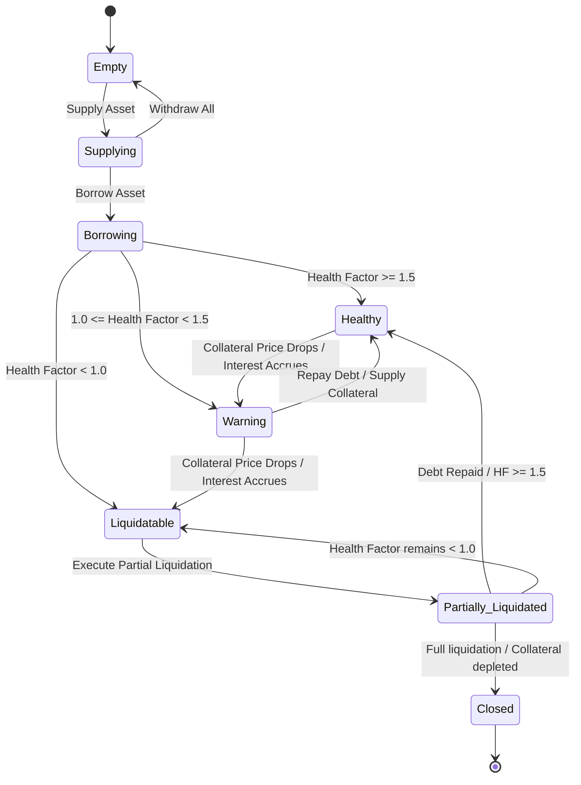
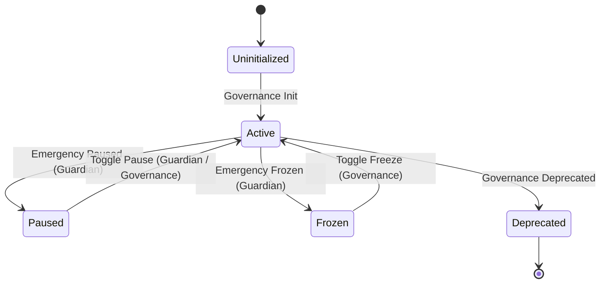
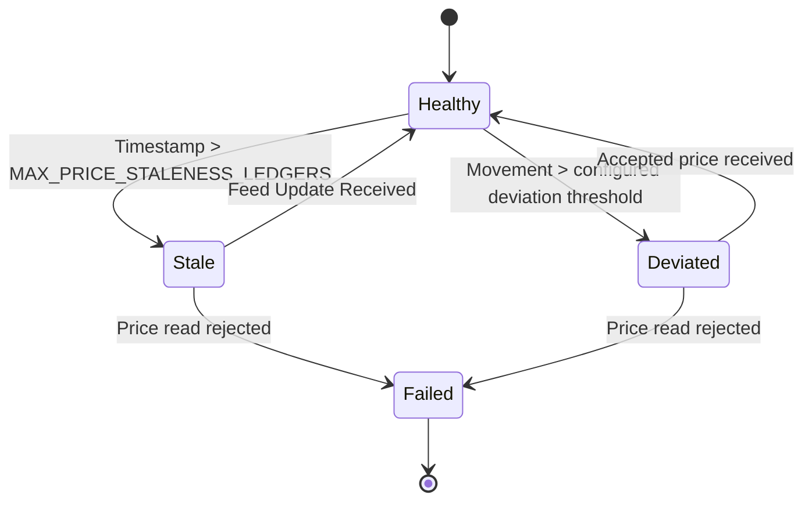
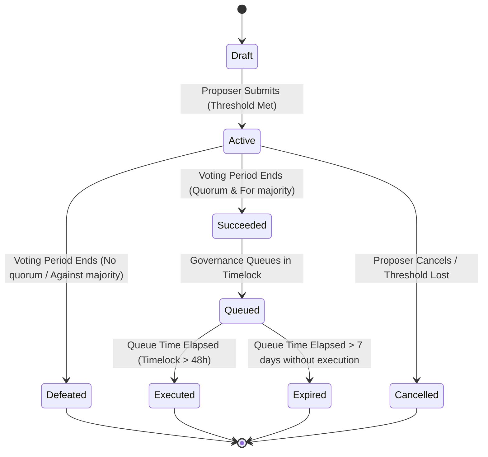
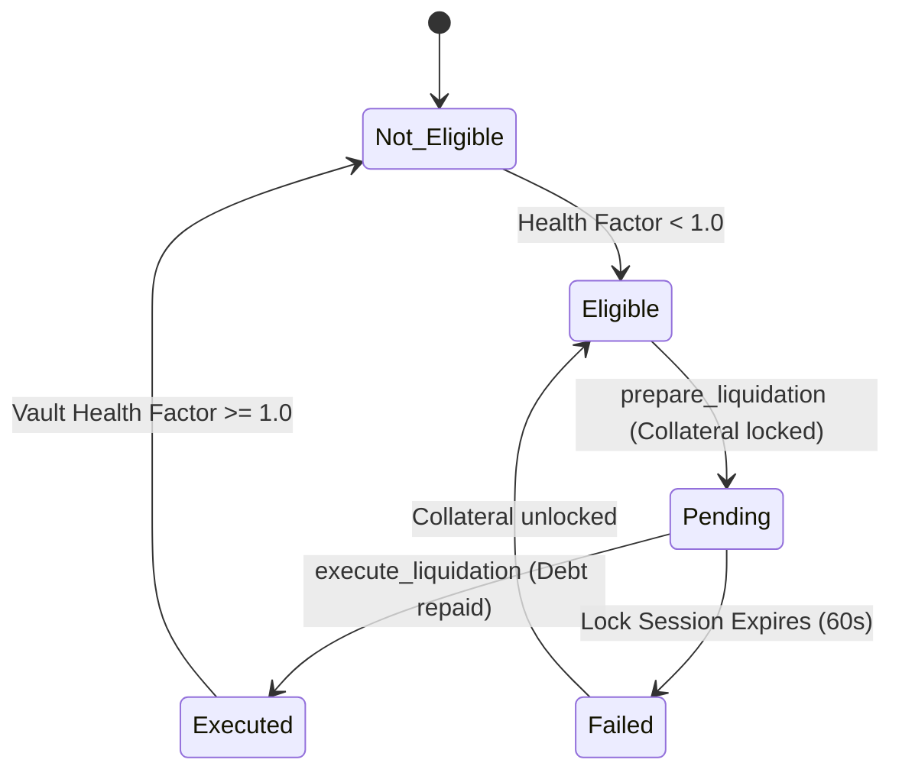

# 16 - State Machine Specification

This document details the state machine configurations and transitions governing the core entities of UdonFi V2.

---

## 1. User Position State Machine

Tracks a user's vault status based on supplied collateral, borrowed debt, and the position's Health Factor ($HF$).

### Transition Specifications:
- **`Empty -> Supplying`**: Triggered by depositing assets. Validates that the amount is greater than 0 and the supply cap is not exceeded. Emits `Supply` event.
- **`Supplying -> Borrowing`**: Triggered by borrowing assets. Validates that the user's Health Factor remains $\ge 1.0$. Emits `Borrow` event.
- **`Warning -> Liquidatable`**: Triggered by price feeds or interest accruals. User's Health Factor drops below 1.0. Vault is locked, and borrow/withdrawal actions are disabled. Emits `LiquidationLock` when prepared.
- **`Liquidatable -> Partially_Liquidated`**: Triggered by `execute_liquidation`. Liquidator repays up to the close factor limit. Emits `LiquidationSeize`.

---

## 2. Reserve State Machine

Tracks the status of supported token pools within the protocol.

### Transition Specifications:
- **`Active -> Paused`**: Triggered by the Emergency Guardian or Governance Board. Instantly disables `supply()` and `borrow()` entry points for the asset reserve. `repay()` and `liquidate()` remain active. Emits `ReservePaused` event.
- **`Active -> Frozen`**: Triggered by the Guardian or Governance. Disables deposits, withdrawals, and borrowing. Repayments and liquidations remain active to wind down the pool. Emits `ReserveFrozen`.
- **`Active -> Deprecated`**: Triggered by Governance proposal. Reserve is permanently closed to new deposits and borrows. Users can only repay and withdraw.

---

## 3. Oracle State Machine

Tracks price feed health for reserve assets.

### Transition Specifications:
- **`Healthy -> Stale`**: Triggered when oracle timestamp exceeds the configured staleness window. Transactions using the price revert.
- **`Healthy -> Deviated`**: Triggered when the latest accepted price movement exceeds the configured threshold.
- **`Stale/Deviated -> Failed`**: The adapter fails closed; it does not silently freeze or fallback to a fake price.

---

## 4. Governance Proposal State Machine

Tracks proposal status from submission through execution.

### Transition Specifications:
- **`Active -> Succeeded`**: Triggered when the voting period ends, yes votes meet quorum, and yes votes exceed no votes. Emits `ProposalPassed` event.
- **`Succeeded -> Queued`**: Moves proposal targets to the timelock contract, initiating the 48-hour execution delay. Emits `ProposalQueued`.
- **`Queued -> Executed`**: Executed by a user transaction after the timelock delay. The proposal changes protocol states or upgrades contract bytecode. Emits `ProposalExecuted`.

---

## 5. Liquidation State Machine

Tracks the lifecycle of vault liquidations.

### Transition Specifications:
- **`Eligible -> Pending`**: Liquidator calls `prepare_liquidation()`. The contract evaluates the borrower's health, locks the target collateral, and generates a session ID. Emits `LiquidationLock` event.
- **`Pending -> Executed`**: Liquidator calls `execute_liquidation(session_id)`. The debt is repaid, and the collateral (plus bonus) is transferred to the liquidator. Emits `LiquidationSeize` event.
- **`Pending -> Failed`**: Triggered if the 60-second execution window expires without repayment. The lock is released, and the collateral becomes available for other liquidations.
