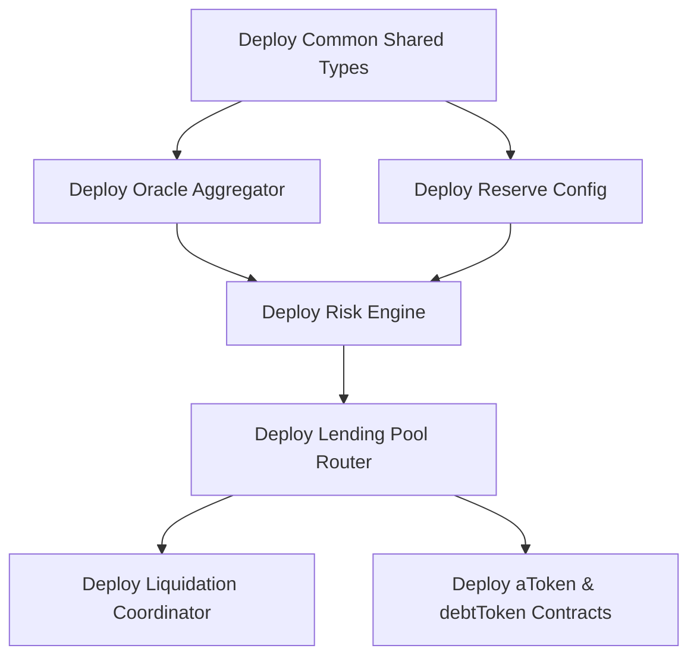

# 10 - Deployment & Configuration Plan

This document outlines the deployment plan, contract initialization scripts, storage TTL variables, and the launch checklist for UdonFi V2.

The current MVP deployment target is Stellar Testnet through:

```txt
Frontend -> Freighter -> Soroban RPC -> Smart Contracts -> Stellar Testnet -> Stellar Expert
```

Off-chain services are not required for the MVP demo.

## 1. Smart Contract Deployment Sequence

Smart contracts must be deployed in a specific order due to cross-contract dependencies:



### Deployment Steps:
1. **Build Wasm Binaries**: Compile smart contracts using the optimization profile.
2. **Upload Wasm to Ledger**: Upload WASM binaries to obtain the Wasm hashes.
3. **Deploy Instance**: Deploy contract instances using the Wasm hashes.
4. **Link Components**:
   - Initialize the `lending_pool` with the addresses of the `risk_engine`, `reserve_config`, and `interest_rate_engine`.
   - Configure the `oracle_aggregator` with active price feeds.
   - Configure the `liquidation_coordinator` with the `lending_pool` address.

---

## 2. Storage Time-to-Live (TTL) Configuration

Stellar Soroban evicts ledger entries if their TTL drops to 0. UdonFi V2 configures the following TTL parameters to ensure data persistence:

| Data Type | Eviction Impact | Base TTL (Blocks) | Extend Threshold | New TTL Max |
|---|---|---|---|---|
| **Contract Instance** | System halts | 50,000 | 10,000 | 100,000 |
| **Asset Reserve Configuration**| Deposits disabled | 50,000 | 10,000 | 100,000 |
| **User Vault Configuration** | User cannot borrow | 4,000 | 1,000 | 6,000 |
| **User Position Balance** | Balances are locked | 4,000 | 1,000 | 6,000 |

*Automation: Every write transaction triggers the `extend_ttl` host function for the associated user balance and vault configuration entries.*

---

## 3. Governance Multi-Sig Setup

The administrative keys of the protocol are distributed across a 3-of-5 multisig wallet representing the Governance Board.

- **Guardian Multi-sig**: Coordinates parameter changes and emergency pauses.
- **Timelock Gating**: Structural contract upgrades and treasury releases must go through the Governance contract and pass a 48-hour timelock delay.

---

## 4. MVP Testnet Checklist

- [ ] Contract unit and integration tests pass.
- [ ] Contracts build to release Wasm.
- [ ] UdonFi contracts are deployed to Stellar Testnet.
- [ ] Reserves are initialized with demo caps and risk parameters.
- [ ] Frontend is configured with Testnet contract IDs and Soroban RPC URL.
- [ ] Freighter is configured for Stellar Testnet.
- [ ] Deposit, withdraw, borrow, repay, and manual liquidation demo flow works.
- [ ] Stellar Expert links open for submitted transaction hashes.
- [ ] No off-chain service is required for the demo.

---

## 5. Mainnet Launch Checklist (Post-MVP / Gated)

Before deploying to the Stellar mainnet, the following tasks must be completed:

- [ ] All smart contract code has passed security audits with no outstanding critical issues.
- [ ] Gas optimization checks verify that all key transactions use less than 70 million instructions.
- [ ] Pyth and Band price feeds are deployed and verified on mainnet.
- [ ] Off-chain analytics architecture is reviewed if production analytics are included.
- [ ] Multisig participants have verified their hardware wallet connections.
- [ ] Standard web frontend assets are deployed to decentralized storage networks (e.g., IPFS / Arweave) with DDoS protection.
