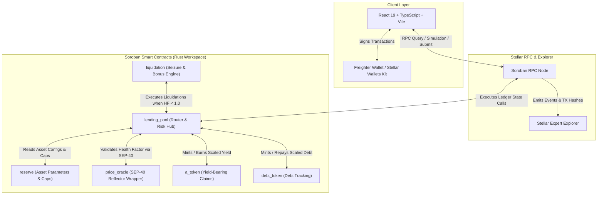

# 🍜 UdonFi: Cross-Border Yield & Working Capital Protocol on Stellar Soroban

## 1. Problem Statement
**What real problem are you solving?**

Cross-border SMEs, remittance corridor anchors, and liquidity providers in emerging markets face a severe **Capital Inefficiency Paradox**:
- **Trapped Idle Capital**: Cross-border trade anchors and remittance operators must keep large buffer pools of fiat/stablecoins (e.g., USDC, EURC) liquid to fulfill instant pay-outs and inventory settlement. This capital sits idle in non-yielding wallets, losing value to inflation and opportunity costs.
- **High Working Capital Costs**: When merchants or corridor operators need short-term working capital (e.g. to pre-fund a batch remittance order or finance cross-border inventory in transit), traditional financial institutions charge exorbitant short-term interest rates (15%–25%+ APR) and take days to approve loans.
- **Incompatibility of Standard DeFi Lending**: Existing EVM-based money markets (like Aave) are built for high-gas speculative leverage rather than high-frequency, sub-cent cross-border trade settlement. They lack native support for Stellar’s anchor ecosystems, sub-second transaction speed, and SEP-40 decentralized price feeds.

**The Solution**: **UdonFi** is a decentralized, non-custodial working capital and yield protocol built on Stellar Soroban. UdonFi enables cross-border businesses and liquidity providers to lock their stable asset balances into interest-bearing reserves ($aTokens$) to continuously earn passive yield, while instantly borrowing working capital against their collateral to settle cross-border trades—with 3-5 second finality and sub-cent fees.

---

## 2. Why Stellar?
**Why does this make sense on Stellar specifically?**

Stellar is the world’s leading blockchain for cross-border payments, remittance corridors, and tokenized real-world assets (RWA). Building UdonFi on Stellar Soroban unlocks distinct structural advantages that cannot be replicated on EVM chains:

1. **Sub-Cent Fees & 3-5 Second Finality**: Micro-borrowing and continuous yield compounding require fast, cheap transactions. Stellar’s sub-cent gas fees make micro-collateral management and instant debt repayment economically viable for real-world SMB transactions.
2. **Native SEP-40 Price Feeds & Reflector Integration**: UdonFi integrates directly with Stellar’s **SEP-40 / Reflector** price oracle feeds. This provides reliable, manipulation-resistant, sub-ledger price quotes for cross-currency liquidation risk checks without needing expensive off-chain node relayers.
3. **Anchor Network Synergy (SEP-24 / SEP-31)**: Stellar’s ecosystem connects hundreds of regulated fiat anchors worldwide. UdonFi acts as the **liquidity engine** for these anchors, allowing them to collateralize asset deposits and draw instant liquidity during peak remittance corridors.
4. **Resource-Efficient Storage & TTL Management**: Soroban’s storage entry TTL model enables UdonFi to manage state efficiently at scale, keeping storage costs predictable for long-term vault positions.

---

## 3. Target Users
**Who will use this?**

1. **Cross-Border Trade Merchants & Importers**: SMBs importing goods internationally who hold USDC/EURC collateral. They supply collateral to earn passive yield and borrow short-term working capital to pay suppliers instantly without liquidating their yield positions.
2. **Remittance Corridor Anchors & Liquidity Providers**: Regional payout operators who require dynamic inventory balances across multiple currency pairs. They deposit reserve capital into UdonFi to generate yield while drawing liquidity buffer loans on-demand during high-volume remittance windows.
3. **Web3 Freelancers & Gig Workers**: Global remote workers earning stablecoins who want to maximize asset productivity by using their earnings as collateral to borrow emergency liquidity while retaining yield-bearing exposure.

---

## 4. Technical Architecture
**Frontend + Contract + Data Flow**

UdonFi is architected as a **contract-first, zero-off-chain-dependency** protocol operating directly on the Stellar ledger.

### Architectural Diagram

### Core Components Breakdown
- **`lending_pool`**: Primary entrypoint contract coordinating `supply`, `withdraw`, `borrow`, `repay`, `toggle_collateral`, interest index updates, and `get_health_factor` evaluation.
- **`reserve`**: Configures risk parameters per asset: Loan-To-Value (LTV), Liquidation Threshold (LT), Liquidation Bonus, Supply Caps, Borrow Caps, and reserve activation flags.
- **`price_oracle`**: Provides standardized USD asset valuation with staleness validation against SEP-40 Reflector contract feeds.
- **`liquidation`**: Non-custodial liquidation engine allowing liquidators to settle bad debt ($HF < 1.0$) in exchange for discounted collateral.
- **`a_token` & `debt_token`**: Scaled balance tokens representing interest-bearing deposits and variable debt obligations.
- **`common`**: Shared fixed-point math (`I128F36` Ray/Wad math), two-slope kinked interest rate curve logic, and compressed user collateral bitmasks.

### Data Flow
1. **User Deposit (Supply)**: User approves SAC transfer $\rightarrow$ `lending_pool.supply` calculates scaled amount ($\text{scaled} = \frac{\text{amount} \times \text{RAY}}{\text{liquidity\_index}}$) $\rightarrow$ Mints `aToken` $\rightarrow$ Updates user bitmask.
2. **Borrow Request**: User requests loan $\rightarrow$ `lending_pool.borrow` queries `price_oracle` for collateral/debt values $\rightarrow$ Simulates post-borrow $HF = \frac{\sum (\text{Collateral} \times \text{Price} \times \text{LT})}{\sum (\text{Debt} \times \text{Price})}$ $\rightarrow$ If $HF \ge 1.0$, mints `debtToken` and transfers asset via SAC.
3. **Interest Accrual**: On every interaction, `lending_pool` calculates elapsed time $\Delta t$ and updates cumulative index $I_t = I_{t-1} \times (1 + R_{borrow} \times \Delta t)$ using the two-slope Kinked Rate Curve.

---

## 5. Complexity Evaluation
**What makes this technically challenging?**

1. **Fixed-Point Ray Arithmetic (`I128F36`) Without Floats**: Soroban disallows floating-point arithmetic. Implementing precise interest compounding ($1 + R \times \Delta t$) and scaled balance conversions requires strict fixed-point math with $10^{27}$ (Ray) precision and overflow-checked multiplication/division in `no_std` Rust.
2. **Compressed Storage Bitmapping for High-Frequency Gas Efficiency**: Storing user collateral and borrowing status across dozens of assets in separate storage keys causes gas bloat. UdonFi uses compressed bitmask manipulation (`u64` bitfields) to check and toggle active asset flags in a single ledger storage read/write.
3. **Atomic Cross-Contract Execution & Health Verification**: A single borrow or withdrawal operation involves atomic state updates across 5 contracts (`lending_pool`, `reserve`, `price_oracle`, `a_token`, `debt_token`). Ensuring invariant safety (preventing reentrancy, undercollateralization, and stale price manipulation) requires strict checks before asset transfer.
4. **SEP-40 Oracle Staleness & Decimals Normalization**: Managing price quotes across assets with different decimal precision and validating ledger staleness (`MAX_PRICE_STALENESS_LEDGERS`) directly in contract code.

---

## 6. Roadmap

### Phase 1: MVP (Completed & Deployed)
- Core Soroban smart contracts (`lending_pool`, `reserve`, `price_oracle`, `liquidation`, `a_token`, `debt_token`) deployed on **Stellar Testnet**.
- Kinked interest rate model, Health Factor calculation, collateral bitfield management, and liquidation engine fully tested.
- React 19 + TypeScript frontend with direct Soroban RPC queries, Freighter wallet signing, position risk gauges, and Stellar Expert explorer integration.
- Automated GitHub Actions CI/CD pipeline covering Rust test suites, WASM compilation, ESLint, and Vite production builds.

### Phase 2: User Acquisition & Ecosystem Integration (Q3 - Q4 2026)
- **Anchor Partnerships**: Pilot integration with Stellar anchor operators (SEP-24/SEP-31) to offer automated working capital credit lines for cross-border corridors.
- **RWA Yield Integration**: Support tokenized real-world yield assets (such as Ondo USDY or treasury-backed stablecoins) as eligible collateral.
- **Community & Liquidity Mining**: Launch testnet incentive programs and developer SDKs (`@udonfi/sdk`) for automated arbitrage and liquidation bots.

### Phase 3: Mainnet Vision & Decentralized Risk Engine (2027)
- **Stellar Mainnet Security Audit & Deployment**: Formal verification and third-party smart contract audit prior to Mainnet launch.
- **Multi-Oracle Fallback Engine**: Upgrade `price_oracle` to aggregate multiple SEP-40 price feeds with medianizer fallback protection.
- **DAO Governance & Safety Module**: Introduce protocol governance for adjusting reserve LTV/LT risk parameters, supply caps, and treasury reserve factors dynamically based on market volatility.
