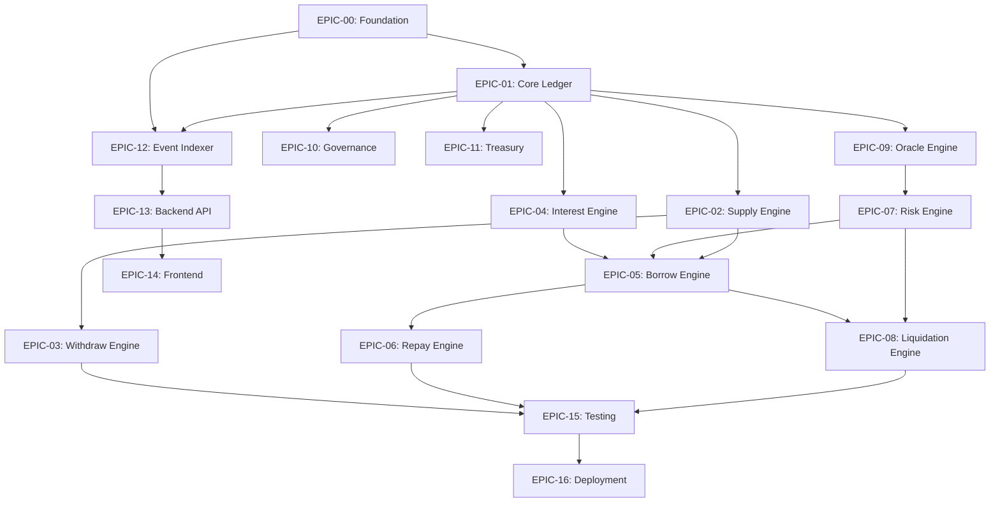

# 04 - Task Dependency & Critical Path

This document defines the dependency network and execution paths for UdonFi V2. It outlines how Epics and engineering tasks relate to each other, details the critical path, identifies parallel workstreams, and notes blocked dependencies.

---

## 1. Epic-Level Dependencies



---

## 2. Task-Level Dependency Registry

The table below catalogs individual task dependencies as defined in [02-epic-breakdown.md](file:///d:/TheAnhProject/UdonFi/docs/project-management/02-epic-breakdown.md).

| Task ID | Task Title | Direct Dependencies | Blocked Status / Reason |
|:---|:---|:---|:---|
| **FND-001** | Initialize Cargo Workspace | None | Unblocked |
| **FND-002** | Setup Postgres & Redis | FND-001 | Blocked until workspace initialized |
| **FND-003** | Configure CI Workflows | None | Unblocked |
| **CORE-001**| Bit-Packing Structures | FND-001 | Blocked until workspace initialized |
| **CORE-002**| ReserveConfiguration Storage| CORE-001 | Blocked until bit-packing library is written |
| **CORE-003**| Custom Contract Errors | CORE-001 | Blocked until common lib is defined |
| **ORC-001** | Implement Oracle Aggregator | CORE-001 | Blocked until base types are defined |
| **RSK-001** | Health Factor Calculator | CORE-002, ORC-001 | Blocked until Reserve config and Oracle exist |
| **RSK-002** | Position Safety Validator | RSK-001 | Blocked until health factor math is implemented |
| **SUP-001** | Core Supply Method | CORE-002 | Blocked until Reserve config storage is ready |
| **SUP-002** | Deploy Custom aToken Crate | SUP-001 | Blocked until pool supply function is ready |
| **WTH-001** | Implement Withdraw Method | SUP-001, RSK-002 | Blocked until supply is ready and safety check is written |
| **INT-001** | APY Kink Curve Math | CORE-001 | Blocked until math types are defined |
| **INT-002** | Global Compounding Accruals | INT-001 | Blocked until curve calculations are written |
| **BOR-001** | Implement Core Borrow Method | SUP-001, INT-002, RSK-002| Blocked until deposit, interest accrual, and safety validator exist |
| **BOR-002** | Deploy Custom debtToken Crate| BOR-001 | Blocked until borrow function exists |
| **RPY-001** | Implement Repay Method | BOR-001 | Blocked until borrow functions exist |
| **LIQ-001** | Prepare Liquidation Step | RSK-002 | Blocked until safety checks exist |
| **LIQ-002** | Execute Liquidation Step | LIQ-001 | Blocked until prepare session manager exists |
| **TR-001**  | Treasury Fund Manager | CORE-001 | Blocked until common lib types exist |
| **GOV-001** | Proposal Lifecycle Manager | CORE-001 | Blocked until common lib types exist |
| **GOV-002** | Contract Upgrade Coordinator| GOV-001 | Blocked until proposal manager exists |
| **IDX-001** | Node.js Event Scraper | FND-002 | Blocked until docker postgres/redis are running |
| **IDX-002** | XDR Event Decoder | IDX-001 | Blocked until scraper daemon is ready |
| **IDX-003** | Relational Sync Pipeline | IDX-002 | Blocked until decoder is ready |
| **API-001** | REST API Controllers | FND-002 | Blocked until docker postgres is running |
| **API-002** | Sync Lag Middleware | API-001 | Blocked until API controller routing is established |
| **FE-001**  | Freighter Wallet Actions | FND-001 | Blocked until workspace is ready |
| **FE-002**  | APY Curve SVG Graph | FND-001 | Blocked until workspace is ready |
| **FE-003**  | LED Config Matrix Grid | FND-001 | Blocked until workspace is ready |
| **TST-001** | Contract Integration Tests | SUP-001, BOR-001, INT-002| Blocked until supply, borrow, and accrual logic are implemented |
| **TST-002** | property-Based Invariant Tests| INT-002, TST-001 | Blocked until accrual logic and integration suite exist |
| **DEP-001** | Contract Deployer Automation| FND-001 | Blocked until workspace exists |
| **DEP-002** | Reserve Config Initializer | DEP-001 | Blocked until deployer script exists |

---

## 3. The Critical Path

The Critical Path consists of the sequential chain of tasks that directly determine the minimum duration of the project. Any delay in these tasks pushes back the main launch date.

```
[FND-001: Workspace Setup]
        │
        ▼
[CORE-001: Bit-Packing]
        │
        ▼
[CORE-002: Reserve Storage Schema]
        │
        ▼
[ORC-001: Oracle Aggregator]
        │
        ▼
[RSK-001: Health Factor Calculator]
        │
        ▼
[RSK-002: Position Safety Validator]
        │
        ▼
[SUP-001: Core Supply Method]
        │
        ▼
[INT-001: Kink Curve Math]
        │
        ▼
[INT-002: Compounding Accruals]
        │
        ▼
[BOR-001: Core Borrow Method]
        │
        ▼
[LIQ-001: Prepare Liquidation]
        │
        ▼
[LIQ-002: Execute Liquidation]
        │
        ▼
[TST-001: Integration Tests]
        │
        ▼
[TST-002: Property-Based Invariant Tests]
        │
        ▼
[DEP-001: Contract Deployer]
        │
        ▼
[DEP-002: Reserve Config Initializer] (Launch-ready)
```

---

## 4. Parallel Workstreams

To maximize velocity, the team can run three primary parallel workstreams:

1. **Smart Contracts (Core Track)**
   - Focused entirely on the critical path: building out common libraries, oracle adapters, risk engines, supply/borrow cores, and liquidation systems.
2. **Off-Chain Indexer and API (Backend Track)**
   - Starts in parallel as soon as `FND-002` (Docker) and `CORE-001` (schema definitions) are completed.
   - Development path: `IDX-001` -> `IDX-002` -> `IDX-003` -> `API-001` -> `API-002`.
3. **Frontend Client App (UI Track)**
   - Starts in parallel using static mock data engines (Simulator mode).
   - Tasks `FE-001`, `FE-002`, and `FE-003` can be developed concurrently by frontend developers, and then integrated with the live API in Sprint 9 and 10.

---

## 5. Recommended Optimal Implementation Order

1. **Phase 1: Project Genesis & Foundation Setup (Sprint 1)**
   - Execute `FND-001`, `FND-002`, `FND-003` to unlock pipelines and environment containers.
   - Execute `CORE-001`, `CORE-002`, and `CORE-003` to establish common schemas.
2. **Phase 2: Oracles & Position Risk (Sprint 2)**
   - Build `ORC-001` to fetch feed data, then immediately follow with safety calculations `RSK-001` and `RSK-002`.
3. **Phase 3: Liquidity Operations (Sprints 3 to 5)**
   - Build supply functions (`SUP-001`, `SUP-002`) and withdraw functions (`WTH-001`).
   - Implement interest math (`INT-001`, `INT-002`).
   - Deliver borrow and repay functionality (`BOR-001`, `BOR-002`, `RPY-001`).
4. **Phase 4: Liquidations, Treasury & Governance (Sprints 6 to 7)**
   - Implement the two liquidation stages (`LIQ-001`, `LIQ-002`) and treasury allocations (`TR-001`).
   - Implement proposal gating and contract upgrade patterns (`GOV-001`, `GOV-002`).
5. **Phase 5: Off-Chain Integration (Sprints 8 to 10)**
   - Build indexers (`IDX-001` through `IDX-003`), followed by APIs (`API-001`, `API-002`), and complete front-end bindings (`FE-001` through `FE-003`).
6. **Phase 6: Invariant Testing & Deployment (Sprint 11)**
   - Conduct extensive property tests (`TST-001`, `TST-002`) and deploy scripts (`DEP-001`, `DEP-002`).
